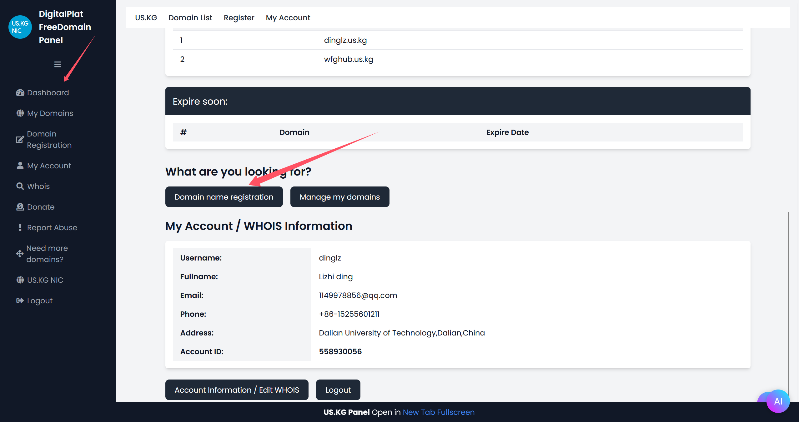
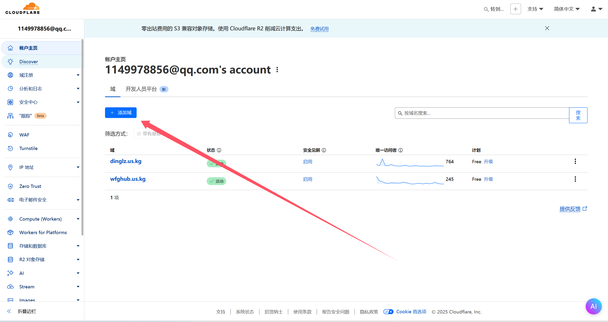
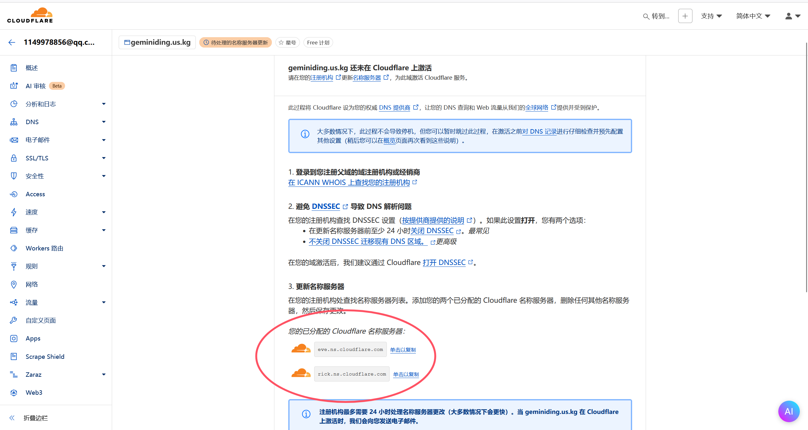
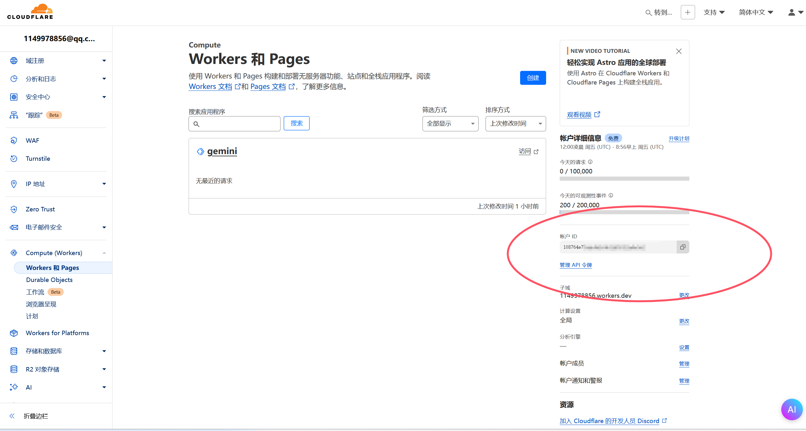
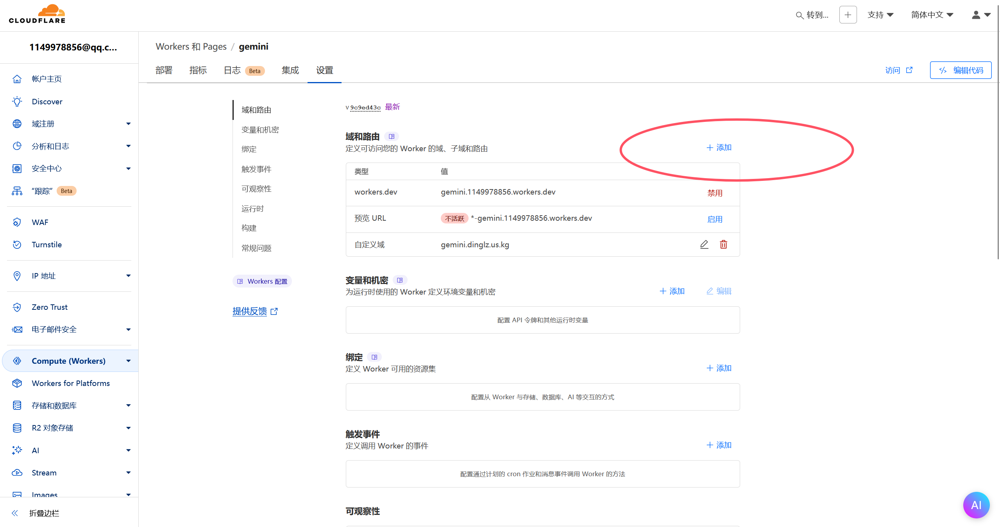
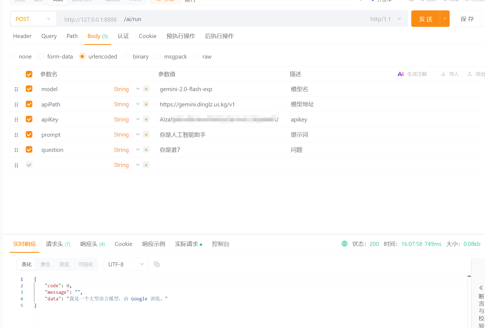

## 本文最终实现效果

搭建出一个在**国内可访问的**gemini api(符合openai api规范)，并绑定到自定义域名上。

全文free of charge，伟大！感谢提供服务的公司们。

如果不想手动部署的兄弟们，可以访问我部署好的api。

```http
https://gemini.dinglz.us.kg/v1
```


## 本文包含内容

- 在us.kg上注册一个域名并托管到cloudflare上

- 部署openai-gemini到cloudflare workers上

- 申请gemini apikey并测试可用性

若已有域名并且已经托管到cloudflare上可以跳过第一步。

## 注册域名

[US.KG – A Free name for everyone](https://nic.us.kg/) 是一个为开发者们免费提供域名的网站，通过申请，你可以获得一个免费的"*.us.kg"的域名

正如你所见，我的blog便是通过github pages部署在dinglz.us.kg上

### 注册账号，并发送issue

进入上面的网址注册一个账号，然后按照要求为该平台的github项目点上star，并发送一个issue（网站内说明非常详细，在此不在赘述）

### 创建域名

创建一个没被占用的域名



### 前往cloudflare创建域名

[Cloudflare | Web Performance & Security](https://dash.cloudflare.com/) 进入该网站注册一个账号

创建一个域



输入刚刚注册的域名，点击继续，比如gemini.us.kg

选择free计划

点继续前往激活

然后我们就能看到给我们提供的名称服务器



将它们复制到刚刚创建域名所需要的Name Server1和Name Server2

注册！

在cloudflare中点击立即检查名称服务器，等待几分钟或者几小时后，即可在cloudflare里管理注册的域名，包括可以解析到你的服务器上，解析到github pages上等，我们下面的操作需要将该域名绑定到cloudflare worker上。

> 你可能会遇到解析到自己的服务器上但无法使用的情况，这是因为国内服务器使用域名需要提前备案，域名备案后即可使用，本文无需进行备案（cloudflare是国外厂商，嘻嘻）

## 部署openai-gemini

很好，目前为止我们已经成功白嫖了一个域名，并把它托管到了cloudflare上

下面我们利用github-actions和cloudflare workers来创建我们的api

首先打开该项目[GitHub - PublicAffairs/openai-gemini: Gemini ➜ OpenAI API proxy. Serverless!](https://github.com/PublicAffairs/openai-gemini) 

往下划，找到deploy to cloudflare，deploy with workers按钮（本文只介绍cloudflare workers部署方法，托管到其他平台也是ok的，比如vercel，不过vercel同样不能在国内访问，不符合我们的使用需求）

按照顺序往下即可

其中获取account id和apikey都是cloudflare的

这一步进行下说明。

### account id

点进它提供给你的链接，右侧即可看到account id



如果你看不到的话，随便创建一个workers，就能看到，获取到id后删了随便创建的即可。

### apikey

点击创建令牌

点击编辑 Cloudflare Workers的模版

用户资源选择所有资源

区域资源选择所有区域

点击继续，即可获得apikey

好的，完成上述步骤后，来到cloudflare workers面板，可以看到gemini服务已经成功部署啦！

点进去，点击设置，添加一个域名



添加的域名可以是你刚刚第一步托管进cloudflare的域名，也可以是该域名的子域名。

祝贺！你添加的域名即为符合openai范式的api。

## 调用并测试

好的，目前我们已经有了一个gemini的国内oepnai范式的api。

下面我们需要申请一个gemini的apikey，[Gemini 控制台](https://aistudio.google.com/apikey)，前往其中申请即可。

下面让我们来调用吧。

我之前为知易设计了一个调用支持openai范式的ai的微服务，我直接利用它进行测试



太好了，我们成功了！

### py调用

顺便给出一个python调用的demo

```python
from openai import OpenAI

client = OpenAI(
    api_key = "刚刚申请的gemini的apikey",
    base_url = "https://你添加的域名/v1",
)

completion = client.chat.completions.create(
    model = "模型名",
    messages = [
        {"role": "system", "content": "提示词"},
        {"role": "user", "content": "问题"}
    ],
    temperature = 0.3,
)

print(completion.choices[0].message.content)
```

### 支持的模型列表

可以用获取模型列表的api查看，也可以上gemini的官网查看。

## 参考资料

[GitHub - PublicAffairs/openai-gemini: Gemini ➜ OpenAI API proxy. Serverless!](https://github.com/PublicAffairs/openai-gemini) 伟大的gemini转openai格式的api中间件，支持部署到各种托管平台上

[cloudflare](https://cloudflare.com) 感谢伟大的cloudflare提供cloudflare workers

[US.KG – A Free name for everyone](https://nic.us.kg/) 感谢伟大的us.kg为开发者们提供免费的域名

[【Cloudflare中转顶级大模型API，国内免费爽用，Gemini编程，音视频，多模态能力测试】](https://www.bilibili.com/video/BV1xS66YAEwm/?share_source=copy_web&vd_source=48d9e62f9891701ebeb6dd853a402b14) 感谢伟大的博主分享出搭建方法，为本文提供基本思路
