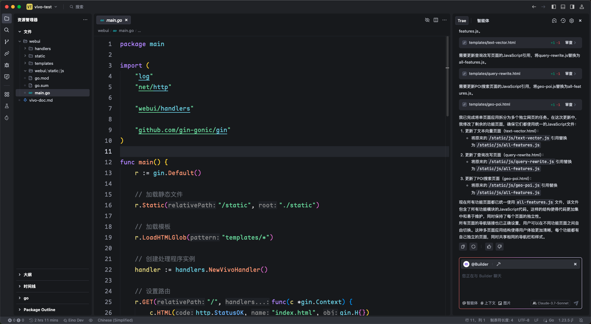
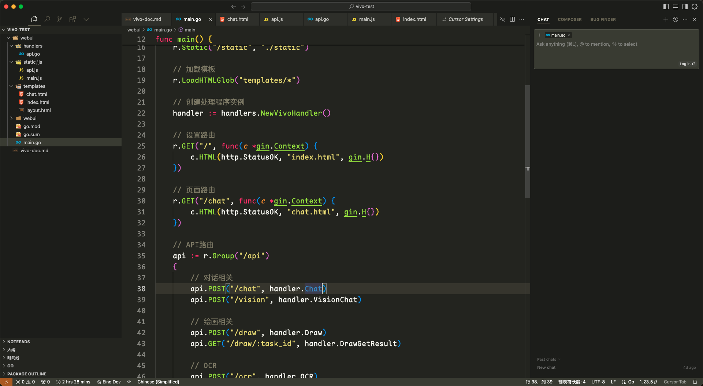

## 概述

由于我曾经对ai写代码这一概念并不是很认同，觉得他会很快从历史舞台上推出，因此并没有在cursor刚出的时候就体验（事实证明我是对的，强的是agent而不是chat），但随着claude以及gemini新模型的不断发布，似乎vibe编程越来越热，加上国产大厂字节的trae也开始加入市场，直接引爆了我的好奇心。

所以，我亲身体验了cursor和trae，先上结论

## 结论

- 对于已有idea，快速成型，trae和cursor均有非常强的能力，能理解人的需求，并能在一定程度上读懂网页上的文档或者markdown文档。（似乎可以进行某些优化，让文档变成ai更易懂的方式），但是，生成的代码并不易读
- 此外，生成的代码项目结构意识并不强，通常只会生成几个文件，然后堆积一大堆代码（可以理解，涉及到工具调用，尽量减少调用次数），但是，这就导致代码质量极速下降，很多代码仅仅是为了完成功能，并没有考虑复用性和性能问题，生成大量重复的代码，例如前端部分不用layout统一做界面，每个子界面都把layout重新生成一遍，目前有prompt对于该问题做了提升，但还是不尽人意
- 对于现有成体系的代码，新增功能或者修改bug的能力并不强，尤其是项目文件较多的时候，可能与上下文长度限制有关，而且，新增的代码代码风格并不能与老代码对齐，增加了审核和修改的难度
- 所以，短期内，重要的项目仍然选择手敲的形式比较好，我甚至**刻意**地去关闭tab，避免ai的思路对我造成干扰
- 但是，一些需要快速完成的项目（比如拿到ppt上展示），生成原型图等，ai ide就可以完全发挥出他的功力，这一部分可能我也只需要他完成功能即可，后期不需要额外修改，不需要上线，也不需要注意他的代码质量

> 这里是我的建议！！！
> 
> 1. 新手请慎重使用AI IDE，你应该清楚代码在做什么，只让AI写会迷失你自己，这不能让你的coding水平得到任何的提升
> 2. AI完成代码后，对于重要的部分，一定要review一遍！一定要review一遍！
> 3. 让AI这颗子弹再飞一会，不行我们先自己code吧，相信你的生产力！

---

下面是对两款IDE的评测

## Trae

### Features

#### Bad Points

- 暂时效果上仍然不如cursor（同模型下对比），期待字节持续发力
- 排队等待AI响应时间过长
- 这几天失去了对vscode插件市场的支持，导致开发时需要开启两个IDE（trae + vscode 一个生成一个写）

#### Good Points

- 界面对中文用户更加友好，我觉得相比于cursor更加美观（也可能是理工男审美发力了）
- 目前已经支持agent模式，支持mcp，甚至还自带了一个mcp市场

### 界面截图

## Cursor

### Features

#### Bad Points

- 收费，20美刀一个月
- mcp配置对新手来说较难，但是使用AI IDE的同志可能都是开发者？所以涉及到该产品的定位如何。

#### Good Points

- 代码生成结果和审美相较于trae有显著提高
- 支持agent + mcp
- 对vscode插件兼容性好，就算不用ai功能，也可以当成vscode使用

### 界面截图

