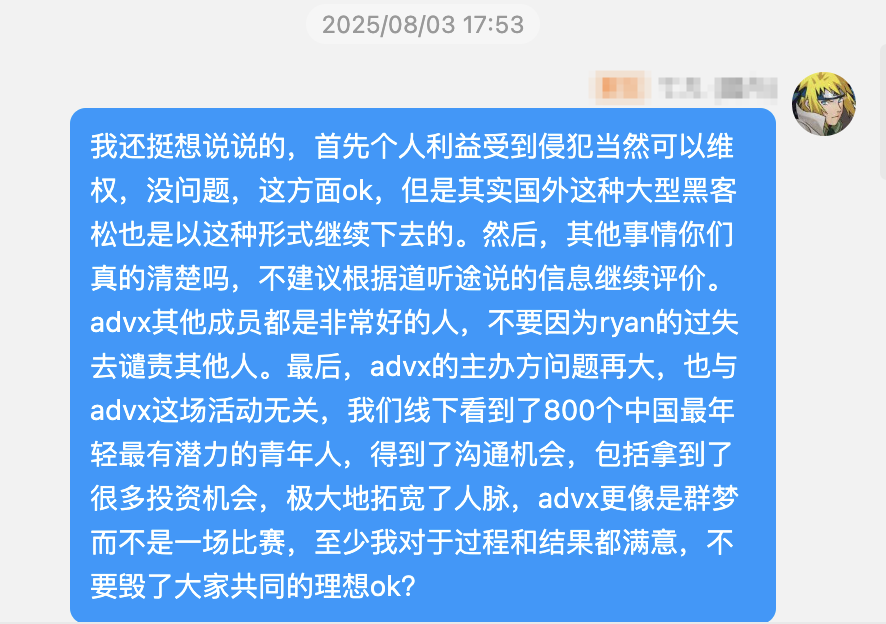
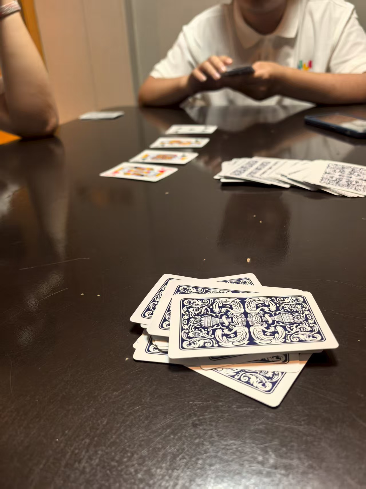
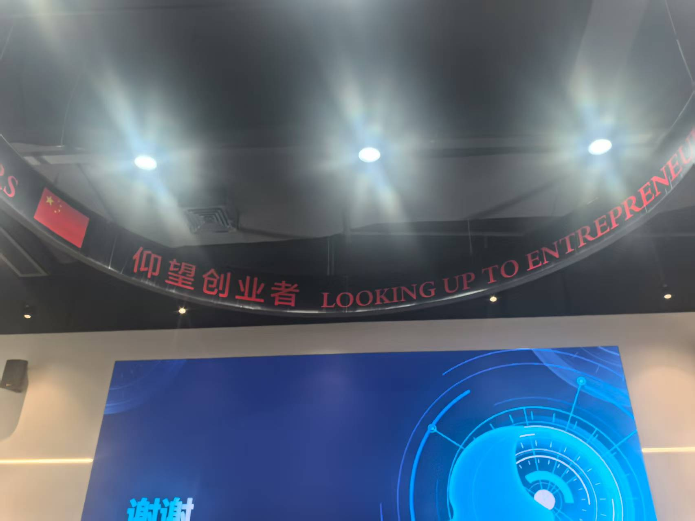

## 日记

相比于直接一股脑地把我的看法吧啦吧啦说出来，我更想先聊聊从暑假开始到现在我的经历，所以前面应该算是日记时间，不想看的朋友可以直接跳过

---

Let's go!

先说说大概的过程吧

- 日本行
- 西安实习
- AdventureX
- Vivo夏令营
- 在家蹲着

### 日本行

结束了该死的期末周，被折磨了一个学期筋疲力尽，心中怀着对后面几个活动的期待，去日本玩玩。当时去之前还琢磨着干各种事情，比如说灵码杯的发起与筹办，我承认灵码杯确实是受到了AdventureX的启发，但确实是我遵循内心做出的一个正确的选择（为什么说正确呢我们后面再聊）在考完和等待去日本的时间里，我就一直在1.完成软件杯的作品 2.办灵码杯，从考完试，我就开始联系灵码的工作人员也就是雅纯姐姐，她给了我很大的鼓励和支持，让我有信心能把灵码杯办起来，很难想象我在五天内完成了从策划到拉到赞助到说服学校老师的全部流程，在日本期间完成了灵码杯的宣发。

灵码杯的想法呢最初也得到了政阳哥哥，文聪哥哥，源东哥哥，浩然哥哥的认可和支持，所以我们组成赛事组开始办这个赛事，不管是从经验，工作，资源上他们都在很大程度上帮助了我，总之这件事算是办了，然后就是安心在日本玩的过程，想起来来日本之前的几天，宇轩还跟我说别想那么多，不如想想怎么在日本好好玩玩（，事实证明他说的对，不过得益于我的好室友是日本通，所以我们在日本仍然玩的非常开心（在我本人完全没做准备的情况下hhh）

整个日本游让我对日本有了很大的改观

就是这种感觉你们懂吧hhh

最让我喜欢的可能是日本随处可及的那种咖啡厅的氛围，就是什么都不做，朋友们聊聊天，或者单纯坐着

这是宇治

好喜欢这种古老和现代结合的感觉，带来了宁静

日本之行就聊这么多吧，然后匆匆赶赴西安

### 西安实习

我对西安的第一印象就是**热**，这个古城的氛围我倒是没怎么感受到（可能因为太热了没出门，bushi。肉夹馍超级好吃，打工的早晨吃的基本上都是肉夹馍，有时候晚上也吃

说起来来西安之前，我对这次实习还是蛮期待的，当时的面试官和我聊的理念让我还是蛮兴奋的，确实很符合我当时的一些想法（**当时**）总之是做一家vibe coding插件的公司，然后员工拿自己家的插件做一些外包的活。

然后，

事实证明：AI也需要开发者有相关的开发经验和功底，不是随便来几个小白就能立马上手的

这次给我最大的经验就是，AI还远不能替代程序员的活，还有很长的路要走，由于被几个小白教我干活，不算太愉快，这个经历我们弃之不谈，算是给我涨涨教训，收获几乎没有

西安实习中间去了一次济南，看法老的演唱会，顺便跟我几个高中好朋友会面，还是蛮感慨的，看到大家都有自己的事情在做，每个人也变了很多，圈子一直在变，人也在一直向前，我们也不要为了分开而悲伤嘛，总之小聚，然后回去继续实习

千等万等终于等来了杭州行，这个暑假收获最大的，AdventureX

### AdventureX

先说说看我对于AdventureX的看法，我知道网上对它的骂声很多，也有一堆不好的瓜，但是对于活动本身我觉得没有问题，很少有能把这八百个人聚在这里的机会了，所以我拒绝对它的批评，为此我还和群友吵了一架

我觉得这能代表我的态度了，所以对这件事不谈，聊聊我这五天前后中的经历

首先第一天是好友聚餐环节：

下午线上聊了本科大工现在南大的容贤学长，互相聊了经历，主要听了听他办南客松（全南京市的黑客松）的经验，学到了很多，又指导了我学习，创业，开发上的很多疑惑。

很高兴和很多朋友有了线下见面一起喝咖啡聊天的经历，和来自西交利物浦，大二辍学去硅谷创业的Klein，钉钉呆过，打完advx就入职字节的sky，川大美术的转转聊了很久，第一天就感受到了共鸣真好，有一种找到“同类”的感觉hhh。学到了很多，比如怎么去看问题，怎么去抓用户需求，什么是一个好的产品。我觉得这些没有标准答案，但大家的理解对我启发都很大。

然后晚上吃火锅的时候又来了一堆朋友，晚上去酒吧喝酒，又面基了之前就认识，大一创业的区同学，还有很多很多优秀的朋友。

总之第一天就感受到了那种氛围，开始格外期待起advx的第一天。

来啦！

上午提前和我的队友打个照面，一个很了不起的连续创业者，然后逛展，很遗憾我advx的逛展次数就两次，这一次和展会那一天，上午把所有展会都逛了，顺了整整四袋子物料，为此我在出发去下一个地点之前还寄了三个袋子回合肥，展会上见到了很多朋友，中午出去吃了个饭。

下午我们现场寻找我们的另一个队友，说来也好笑，我们本来有一个超强的设计师姐姐，但是因为台风被困在香港了，所以只能现场寻觅队友。好在文慧给我们推荐了一个杭电的小姑娘，美术同学，可惜的是她没有figma经验，更多是游戏方面的美术经验。不过没有关系，作为一个优秀的vibe coder，肯定得发挥前端上ai的主观能动性（bushi，当然美术同学也给我们提供了很多ui上的指导和图片素材，我是不会承认我提交作品前一个小时还在被逮着改ui的（bushi

下一天让我印象最深的是上午的共绩算力关于共享算力的workshop，AI平权的理念也在我这埋了一颗很深很深的种子，晚上见到了容贤学长，可惜因为大家都忙着coding，没时间交流哈哈哈。

再往后一天我记得也是全天的coding，但是见到了很多有意思的项目，比如结印编程哈哈哈，给我帅麻了

还有那个很有名的马桶

然后和来自OSChengDu的poly面基了，非常谦虚也很有实力的大佬，偶遇了Soulter，后来在群友介绍下才发现是AstroBot的作者哈哈哈，早知道拷打一下了。

晚上和一个投资人深度chat了很久，给我的启发很大，变得越来越想创业（bushi

敲代码的最后一天，还是疯狂敲代码，准备物料

这一天受到了几家初创和一些伙伴的合伙邀请：

比如说一个UGC平台，一个社交辅助（我一开始还误认为是类似于date app，后来聊过才发现是ai帮人聊天这种），收到了老哥很大的思路开阔上的帮助，okok稳的

又聊了几个投资人，其中一个口出狂言（不是，说现在他愿意投我，但是等我大学毕业了就不一定了，创业一定要趁早

这一天看了真格的分享，我觉得很有意思，和大家分享分享：

最后一天，路演，讲了一个上午加一个中午，超累，得到了很多很多的认可，也因此加了很多很多大佬，但这些不谈，我更想和大家聊聊我下午逛的时候看到的很多有趣的项目。

1. 你和这只狗狗很像

项目就是帮你找到和你长的最像的那只狗，很有意思，目的是为了让你收留这只长的和你最像的流浪狗，跟他们开发聊了下把这套系统迁移到猫身上的可能性，得到了猫毛太多，不好做面部识别的结论，有点失望

2. 给国足设计的足球

总之就是不管你怎么踢，这只足球都能利用CV和内部的滚轮把自己送进球门，为国足正名！

3. 和马斯克合了影

很难解释，看图吧

晚上闭幕式，很高兴甚至拿了个kimi for vibe赛道的奖（本来没想着拿奖的捏

晚上出去和新认识的几个朋友聊天，他们有一个创业idea，很高兴说动了我，大家决定一起做，我作为CTO“加盟”了他们

第二天游西湖，好耶！

结束了这个令我印象极其深刻的活动，飞深圳！

在深圳之前还有认识了几个想搞黑客松的朋友，这次advx算是给大家打了个样，全国各种黑客松组织开始兴起，企业和投行开始变得愿意为黑客松买单，这也是我在文章一开始说灵码杯是个正确的决定的原因。但是由于这次advx发生了一些事情（不想说了）所以大家想办真正属于我们自己的黑客松，我遇到了D哥，他有理想，也有资源去办一场新的全国性的大型黑客松，他也在寻找志同道合的人一起办这个事情，所以我加入了他们，我们把这叫做“创客松”，我们也在前期准备阶段，筹办下一次超大型的黑客松，真正打动我的一些理念，像让来自贫穷地区的孩子也能接触到这些资源，这就不得不说我自己，我感觉我从小到大一更像是在沉淀阶段，一直一直学习知识，直到这个暑假才有走向更大舞台的机会，也感谢我自己的这种热情让我能有现在的能力，但是如果我能在我小时候接触到像探月学校这样的资源都话，成就肯定远不止我现在，总之很感概。另一个就是办不去讨好投资人的黑客松，只是为了见证创造，这对我们而言就够了，我们就是想看那些了不起的想法，想见证那些或许大家觉得没有任何意义的创造，这太酷了！推动推动推动，希望能早早地和大家见面。

回归主线，飞深圳！

### Vivo夏令营

这三天印象最深的事情，是学习了一项新技能：搓麻将（bushi，神奇的vivo给我们安排的房间里有台麻将机，所以我们每天晚上回去都在搓麻将hhh，以及惯蛋，想不到在安徽之外还能见识到这个玩法

没错我们三个神人在这玩24点玩了一个小时，由于传统玩法被我们秒了，所以大家开发了位运算，左移右移这种玩法，鉴定为学计算机学的（bushi

当然也是有很多收获，比如学习了微调技巧和端侧模型部署，（又咨询了wc学长很多，wc哥哥太强辣）和vivo投资老总说上了话，学习到了演讲技巧（bushi。参观了vivo工厂，超棒。

结束以后没直接飞回家，而是跑到广州去找政阳哥哥聊天，我俩在夏令营一天晚上就聊了很久很久，我还是要再表达一遍对政阳哥哥的感谢，作为我大一时期的引路人，切切实实帮助了我很多很多，也纠正了我不少想法，引领我走上了正确的道路。这次来到广州，参观了企业微信和微信，又聊了聊创新，创业，黑客松。我趁机拿我的一些业务咨询了政阳哥哥，也得到了不小的启发哈哈哈，这次又从政阳哥哥身上学了很多，飞回家！

### 在家蹲着

在家蹲着期间干了哪些事呢：

1. 完成了灵码杯第二次分享，一切有条不紊！参赛队伍达到115支，是我设想情况的两倍，超级期待看到大家的作品！

2. 跟D哥，行知哥聊黑客松的筹备和安排，和mark老师请教黑客松的一些事项，我们在憋一个大活！大家期待啊哈哈哈

3. 完成了我们自家初创的前期准备，跟一个超好的学长聊了很久，基本解决了我关于搜广推的全部疑惑，也是政阳哥哥推荐的，感恩！

4. 参加了一家初创项目的前期研究环节，可以透露下也是在做agent，因此得到了超棒的思路和资源

## 感悟

### For AI创业

1. AI创业超级欢迎年轻人，我见到了一堆高中生CEO，现在是AI时代的开始，现在抓住机会是**最好**的时间点

2. 创业初期不要去想核心竞争力，套壳（Agent）完全没问题！想想Manus吧，早期完全不用担心被抄袭等等问题，**自信**Forever

3. 好的产品**一定是**Dog Feeding的，即自己会用自己做出来的东西，这个产品才是有用的，不要去抓伪需求，找真需要！

4. 创业最好的机会一个是在十年前，一个是现在

5. 不要觉得创业很帅很光鲜亮丽，我身边的CEO朋友们**从来不说**自己是CEO，创业是过独木桥，成功的是极少数，不要在乎头衔，也不要总拿头衔说事

总之----仰望创业者

### For 黑客松

主要聊聊我为什么想办黑客松：

1. 我觉得我目前呆的地方（DUT）创新创业氛围不够，我想看到更多创新在这里发生，这是我发起灵码杯**最真实**的想法

2. 我觉得**不公平**，需要让大家接触到一样的资源，就好像上文我谈到的，因为呆的地方不能得到更好的发展，这太不酷了，我们可以为大家带来什么？就业、读研、创业我们不该为大家指定任何一条路！所以我们能做的就是把资源带给大家，至少留给大家一个选择的**机会**，这就足够了，不要因为接触不到错过这个选择。

3. 这是个很好的平台，我认识了很多挚友，也见证了很多伟大的项目

### For Vibe Coding

有幸体验过世面上近乎全部vibe coding产品的我聊一聊我的看法，首先先给个排名（我心目中，不代表真实情况），后面有机会再给大家更新详细的测评：cline + claude4 > claude code + claude4 > argument code > cline +gemini > claude code + k2 > kiro > cursor > windsurf > trae > void

1. vibe coding不意味着不再需要需要编程，意味着需要开发者有更高的架构意识，指挥能力

2. 以后大家将离不开vibe coding，所以所有人都要转变成**全栈**工程师，否则就会被淘汰，这点在初创公司中体现的尤为明显

3. 目前来看vibe coding还是离不开designer，有设计稿再去生成前端界面会更加美观和高效，vibe coding的ui太过同质化且没有想象力

4. 一定要同时保证自己的开发能力，多去了解新的技术栈（如果你自己都不了解怎么让ai去用？ai只会用它最熟的技术栈（在不指定的情况下））所以我现在虽然因为一些活时间很紧，还是vibe coding为主，但是自己做的项目都是要求自己纯手写，古法编程万岁🎉！

## 总结

复盘能聊的差不多也就这些了，总算是有时间停下来好好思考思考，这段时间感觉一直在被事情推着走而不是我推着事情走，希望大家有时间的话还是要慢下来好好想想自己的方向