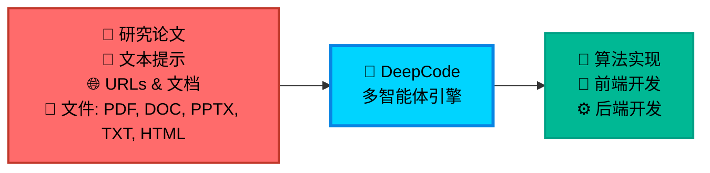
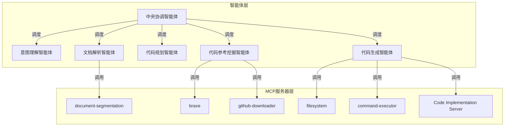
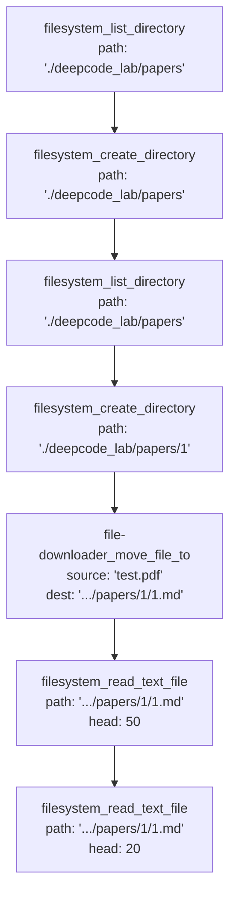

今天我们要看的项目是：https://github.com/HKUDS/DeepCode ，我读的commit是main分支的ab730642731d9c8a400cad78e76962253ac875f2

跟着本篇blog读repo建议把代码拉下来，切到相同的commit，跟着流程一起来读

## 概述

DeepCode 是一个基于多智能体系统的开源框架，旨在将研究论文、自然语言描述等输入自动转换为生产级代码。该项目通过自动化算法实现、前端开发和后端构建，显著提升了研发效率。其核心目标是解决研究人员在实现复杂算法时面临的挑战，减少开发延迟，并避免重复性编码工作。

DeepCode 支持多种输入形式，包括学术论文、文本提示、URL 和文档文件（如 PDF、DOC、PPTX、TXT、HTML），并能生成高质量、可扩展且功能丰富的代码。该系统采用多智能体协作架构，能够处理复杂的开发任务，从概念到可部署的应用程序。



## 入口

要读懂全流程，先找入口，开始于：

``` bash
python cli/main_cli.py --file paper.pdf
```

所以我们先来看`cli/main_cli.py`。

找到main函数，跳过环境检查等等，你会发现最核心的地方在：

``` python
if args.file or args.url or args.chat:
    if args.file:
        # 验证文件存在
        if not os.path.exists(args.file):
            print(f"{Colors.FAIL}❌ File not found: {args.file}{Colors.ENDC}")
            sys.exit(1)
        success = await run_direct_processing(app, args.file, "file")
    elif args.url:
        success = await run_direct_processing(app, args.url, "url")
    elif args.chat:
        # 验证chat输入长度
        if len(args.chat.strip()) < 20:
            print(
                f"{Colors.FAIL}❌ Chat input too short. Please provide more detailed requirements (at least 20 characters){Colors.ENDC}"
            )
            sys.exit(1)
        success = await run_direct_processing(app, args.chat, "chat")

    sys.exit(0 if success else 1)
else:
    # 交互式模式
    print(f"\n{Colors.CYAN}🎮 Starting interactive mode...{Colors.ENDC}")
    await app.run_interactive_session()
```

也就是说我们只需要看`run_direct_processing`函数就ok了

来看：这个函数里的核心代码

``` python
# 初始化应用
init_result = await app.initialize_mcp_app()
if init_result["status"] != "success":
    print(
        f"{Colors.FAIL}❌ Initialization failed: {init_result['message']}{Colors.ENDC}"
    )
    return False

# 处理输入
result = await app.process_input(input_source, input_type)
```

要关注的其实也就是：`app.initialize_mcp_app()`和`app.process_input(input_source, input_type)`，还记得input_source和input_type吗，input_type有chat、url、file，source就是对应的内容

那我们下面分别来看`app.initialize_mcp_app()`和`app.process_input(input_source, input_type)`，记录一下现在的taskList

---

- [ ] 读`app.initialize_mcp_app()`
- [ ] 读`app.process_input(input_source, input_type)`

---

## mcp部分

来看`app.initialize_mcp_app()`，最终定位到

``` python
async def initialize_mcp_app(self):
    """初始化MCP应用 - 使用工作流适配器"""
    # Workflow adapter will handle MCP initialization
    return await self.workflow_adapter.initialize_mcp_app()
```

来看`self.workflow_adapter.initialize_mcp_app()`，核心代码：

``` python
# Initialize MCP application
self.app = MCPApp(name="cli_agent_orchestration")
self.app_context = self.app.run()
agent_app = await self.app_context.__aenter__()
```

诶？原来不是初始化mcp的配置，而是直接初始化了self.app也就是核心的agent，他这里agent就叫做mcp application，总之这里先把cli的app初始化成了cli_agent_orchestration，可以给大家看一下这边agent的架构图：



刚刚初始化的就是中央协调智能体，让我们更新一下tasklist

---

- [x] 读`app.initialize_mcp_app()`
- [ ] 读`app.process_input(input_source, input_type)`

---

那我们接着来看：`app.process_input(input_source, input_type)`

## app.process_input(input_source, input_type)

这里有段挺奇怪的代码：

``` python
# Update segmentation configuration before processing
# 在处理之前更新segmentation configuration
self.update_segmentation_config()
```

看下这个函数：

``` python
def update_segmentation_config(self):
    """Update document segmentation configuration in mcp_agent.config.yaml"""
    import yaml
    import os

    config_path = os.path.join(
        os.path.dirname(os.path.dirname(os.path.abspath(__file__))),
        "mcp_agent.config.yaml",
    )

    try:
        # Read current config
        with open(config_path, "r", encoding="utf-8") as f:
            config = yaml.safe_load(f)

        # Update document segmentation settings
        if "document_segmentation" not in config:
            config["document_segmentation"] = {}

        config["document_segmentation"]["enabled"] = self.segmentation_config[
            "enabled"
        ]
        config["document_segmentation"]["size_threshold_chars"] = (
            self.segmentation_config["size_threshold_chars"]
        )

        # Write updated config
        with open(config_path, "w", encoding="utf-8") as f:
            yaml.dump(config, f, default_flow_style=False, allow_unicode=True)

        self.cli.print_status(
            "📄 Document segmentation configuration updated", "success"
        )

    except Exception as e:
        self.cli.print_status(
            f"⚠️ Failed to update segmentation config: {str(e)}", "warning"
        )
```

发现其实就是先加载配置，然后同步cli的配置

再回来看，然后这个函数的核心就在于：

``` python
# 使用工作流适配器进行处理
result = await self.workflow_adapter.process_input_with_orchestration(
    input_source=input_source,
    input_type=input_type,
    enable_indexing=self.cli.enable_indexing,
)
```

进到这个函数里看看，前面都是预处理，最核心的代码在

``` python
# Execute appropriate pipeline based on input type
if input_type == "chat":
    # Use chat-based planning pipeline for user requirements
    pipeline_result = await self.execute_chat_pipeline(input_source)
else:
    # Use traditional multi-agent research pipeline for files/URLs
    pipeline_result = await self.execute_full_pipeline(
        input_source, enable_indexing=enable_indexing
    )
```

我们来看一下file和url下的全流程，所以我们只需要看下`self.execute_full_pipeline`就行了，更新一下tasklist

---

- [x] 读`app.initialize_mcp_app()`
- [x] 读`app.process_input(input_source, input_type)`

---

并行任务结束了，我们下面来读`self.execute_full_pipeline`。

## self.execute_full_pipeline

读一下发现这个函数最核心的地方就在：

``` python
result = await execute_multi_agent_research_pipeline(
    input_source=input_source,
    logger=self.logger,
    progress_callback=progress_callback,
    enable_indexing=enable_indexing,
)
```

那我们进到`execute_multi_agent_research_pipeline`里，可以看出来我们离核心代码越来越近了

## execute_multi_agent_research_pipeline

先看一下这个函数的注释吧：

```
Execute the complete intelligent multi-agent research orchestration pipeline.

This is the main AI orchestration engine that coordinates autonomous research workflow agents:
- Local workspace automation for seamless environment management
- Intelligent research analysis with automated content processing
- AI-driven code architecture synthesis and design automation
- Reference intelligence discovery with automated knowledge extraction (optional)
- Codebase intelligence orchestration with automated relationship analysis (optional)
- Intelligent code implementation synthesis with AI-powered development
```

翻译来喽：

```
执行完整的智能多智能体研究编排流程。 

这是协调自主研究工作流智能体的主要AI编排引擎，包括： 

- 本地工作区自动化，实现无缝环境管理
- 智能研究分析，结合自动化内容处理
- AI驱动的代码架构综合与设计自动化
- 参考智能发现，结合自动化知识提取（可选）
- 代码库智能编排，结合自动化关系分析（可选）
- 智能代码实现综合，结合AI驱动的开发
```

那我们继续往下读代码：

源代码下面的部分列的也比较详细，分了phase 0、1、2、3，我们也跟着它的思路来看

### phase0

phase0是初始化工作区，核心代码是：

``` python
# Setup local workspace directory
workspace_dir = os.path.join(os.getcwd(), "deepcode_lab")
os.makedirs(workspace_dir, exist_ok=True)
```

其实就是新建了文件夹`deepcode_lab`

### phase1

处理和验证输入，让我们进来看：`_process_input_source`

``` python
if input_source.startswith("file://"):
    file_path = input_source[7:]
    if os.name == "nt" and file_path.startswith("/"):
        file_path = file_path.lstrip("/")
    return file_path
return input_source
```

发现只是把`file://`开头的文件目录改成了正常的文件目录，继续看phase2

### phase2

``` python
# Phase 2: Research Analysis and Resource Processing (if needed)
if isinstance(input_source, str) and (
        input_source.endswith((".pdf", ".docx", ".txt", ".html", ".md"))
        or input_source.startswith(("http", "file://"))
):
    (
        analysis_result,
        download_result,
    ) = await orchestrate_research_analysis_agent(
        input_source, logger, progress_callback
    )
else:
    download_result = input_source  # Use input directly if already processed
```

这一段主要是解析`input_source`，如果他是文件或者url就运行`orchestrate_research_analysis_agent`获取`analysis_result`和`download_result`，如果都不是就直接作为输入内容，作为输入内容可能是为了chat设计的，我们进来看`orchestrate_research_analysis_agent`。

#### orchestrate_research_analysis_agent

老样子，先看注释：

```
Orchestrate intelligent research analysis and resource processing automation.

This agent coordinates multiple AI components to analyze research content
and process associated resources with automated workflow management.
```

中文：

```
编排智能研究分析与资源处理自动化。 

此智能体协调多个AI组件，通过自动化工作流管理，以分析研究内容并处理相关资源。 
```

这一段算是该项目中相当重要的一部分了，解析pdf资源也是我非常好奇它如何处理的地方，后面如果有处理资源的部分我们也只来看pdf资源的部分，我们不去看其他解析了，大家好奇的可以自己去读

首先来看第一步，这一步的核心代码是：

``` python
analysis_result = await run_research_analyzer(input_source, logger)
```

那我们直接进来看`run_research_analyzer`

才注意到`prompt_text`还是`input_source`，那这个是类似于deep research的agent？我们继续往下看：

好，下面初始化了一个新智能体：

``` python
analyzer_agent = Agent(
    name="ResearchAnalyzerAgent",
    instruction=PAPER_INPUT_ANALYZER_PROMPT,
    server_names=get_search_server_names(),
)
```

我们先来看Agent类，`name`、`instruction`、`server_names`的注释

`name` : `Agent name.`

`instruction` : 

```
Instruction for the agent. This can be a string or a callable that takes a dictionary
and returns a string. The callable can be used to generate dynamic instructions based
on the context.
智能体的指令。这可以是一个字符串，也可以是一个可调用对象，该对象接收一个字典并返回一个字符串。该可调用对象可用于根据上下文生成动态指令。
```

`server_names` : `List of MCP server names that the agent can access.`，奥这个就是mcp服务器的配置，那我们先来好好读读：`PAPER_INPUT_ANALYZER_PROMPT`

`PAPER_INPUT_ANALYZER_PROMPT` : 

```
You are a precise input analyzer for paper-to-code tasks. You MUST return only a JSON object with no additional text.

Task: Analyze input text and identify file paths/URLs to determine appropriate input type.

Input Analysis Rules:
1. Path Detection:
   - Scan input text for file paths or URLs
   - Use first valid path/URL if multiple found
   - Treat as text input if no valid path/URL found

2. Path Type Classification:
   - URL (starts with http:// or https://): input_type = "url", path = "detected URL"
   - PDF file path: input_type = "file", path = "detected file path"
   - Directory path: input_type = "directory", path = "detected directory path"
   - No path/URL detected: input_type = "text", path = null

3. Requirements Analysis:
   - Extract ONLY requirements from additional_input
   - DO NOT modify or interpret requirements

CRITICAL OUTPUT RESTRICTIONS:
- RETURN ONLY RAW JSON - NO TEXT BEFORE OR AFTER
- NO markdown code blocks (```json)
- NO explanatory text or descriptions
- NO tool call information
- NO analysis summaries
- JUST THE JSON OBJECT BELOW

{
    "input_type": "text|file|directory|url",
    "path": "detected path or URL or null",
    "paper_info": {
        "title": "N/A for text input",
        "authors": ["N/A for text input"],
        "year": "N/A for text input"
    },
    "requirements": [
        "exact requirement from additional_input"
    ]
}
```

中文版：

```
你是论文到代码任务的精准输入分析员。你必须只返回 JSON 对象，不包含任何附加文本。

任务：分析输入文本并识别文件路径/URL，以确定合适的输入类型。

输入分析规则：
1. 路径检测：
- 扫描输入文本中的文件路径或 URL
- 如果找到多个，则使用第一个有效的路径/URL
- 如果未找到有效的路径/URL，则视为文本输入

2. 路径类型分类：
- URL（以 http:// 或 https:// 开头）：input_type = "url", path = "检测到的 URL"
- PDF 文件路径：input_type = "file", path = "检测到的文件路径"
- 目录路径：input_type = "directory", path = "检测到的目录路径"
- 未检测到路径/URL：input_type = "text", path = null

3. 需求分析：
- 仅从 additional_input 中提取需求
- 请勿修改或解释需求

关键输出限制：
- 仅返回原始 JSON - 前后均无文本
- 不包含 Markdown 代码块 (```json)
- 不包含解释性文本或描述
- 不包含工具调用信息
- 不包含分析摘要
- 仅包含下面的 JSON 对象

{
"input_type": "text|file|directory|url",
"path": "检测到的路径或 URL 或 null",
"paper_info": {
"title": "文本输入不适用",
"authors": ["文本输入不适用"],
"year": "文本输入不适用"
},
"requirements": [
"additional_input 的确切要求"
]
}
```

这个就是分析input_source的类型和信息，那玄机其实在mcp服务器里：`get_search_server_names()`，我们进来看看这个，能用哪些search_mcp

然后发现是用了：brave，也就是`@modelcontextprotocol/server-brave-search`，我们这里不读这个，就来看看brave能干什么。

然后发现是信息搜索，读到这里我觉得挺奇怪的，然后我就在`agent_orchestration_engine.py`的第250行加了如下代码

``` python
with open('test.txt', 'w') as f:
    f.write(raw_result)
sys.exit()
```

然后用`uv run cli/main_cli.py --file test.pdf`跑了一下，果然跟我想的一样，`test.txt`里是：

``` json
{
    "input_type": "file",
    "path": "test.pdf",
    "paper_info": {
        "title": "N/A for text input",
        "authors": ["N/A for text input"],
        "year": "N/A for text input"
    },
    "requirements": []
}
```

我想这个paper_info是怎么取出来的百思不得其解，跑了一遍发现确实取不出来，我猜这里是为了提前留个结构给后面用，绷，所以这个agent的核心其实就在分开url和file，然后区分了一下文件类型，说实话这一步感觉完全没必要，感觉是为了防蠢用的（

好我们接着往下看，下面的重点在：

``` python
# Clean LLM output to ensure only pure JSON is returned
try:
    clean_result = extract_clean_json(raw_result)
    print(f"Raw LLM output: {raw_result}")
    print(f"Cleaned JSON output: {clean_result}")
```

这个`extract_clean_json`是拿来`Extract clean JSON from LLM output, removing all extra text and formatting.`，也就是从大语言模型输出中提取规整的JSON，去除所有多余的文本和格式。

比如如果大家经常做llm相关应用的话，可能遇到过不是纯json文本输出的情况，怎么限制都没用，用这个函数可以直接提取json出来

具体实现步骤我写在注释里了，大家直接看

```python
def extract_clean_json(llm_output: str) -> str:
    """
    Extract clean JSON from LLM output, removing all extra text and formatting.

    Args:
        llm_output: Raw LLM output

    Returns:
        str: Clean JSON string
    """
    try:
        # 首先尝试去掉两端的空白字符行不行
        json.loads(llm_output.strip())
        return llm_output.strip()
    except json.JSONDecodeError:
        pass

    # 然后用正则试试取```json ```中间的内容
    if "```json" in llm_output:
        pattern = r"```json\s*(.*?)\s*```"
        match = re.search(pattern, llm_output, re.DOTALL)
        if match:
            json_text = match.group(1).strip()
            try:
                json.loads(json_text)
                return json_text
            except json.JSONDecodeError:
                pass

    # 根据手动匹配花括号的方法来取出json
    lines = llm_output.split("\n")
    json_lines = []
    in_json = False
    brace_count = 0

    for line in lines:
        stripped = line.strip()
        if not in_json and stripped.startswith("{"):
            in_json = True
            json_lines = [line]
            brace_count = stripped.count("{") - stripped.count("}")
        elif in_json:
            json_lines.append(line)
            brace_count += stripped.count("{") - stripped.count("}")
            if brace_count == 0:
                break

    if json_lines:
        json_text = "\n".join(json_lines).strip()
        try:
            json.loads(json_text)
            return json_text
        except json.JSONDecodeError:
            pass

    # 最后尝试用正则取出json
    pattern = r"\{[^{}]*(?:\{[^{}]*\}[^{}]*)*\}"
    matches = re.findall(pattern, llm_output, re.DOTALL)
    for match in matches:
        try:
            json.loads(match)
            return match
        except json.JSONDecodeError:
            continue

    # If all methods fail, return original output
    return llm_output
```

好了，我们把`run_research_analyzer`看完了，大家记得我们从哪来的嘛，让我们回到`orchestrate_research_analysis_agent`

刚刚看的是step 1，让我们接下来看step 2

核心的代码是：

``` python
download_result = await run_resource_processor(analysis_result, logger)
```

我们进来看`run_resource_processor`，这个函数挺简单的，我们有读之前的agent的经验，读这个就很迅速了，传入的是我们之前上一个agent的分析结果，不记得大家还记不记得了，来看看：

``` json
{
    "input_type": "file",
    "path": "test.pdf",
    "paper_info": {
        "title": "N/A for text input",
        "authors": ["N/A for text input"],
        "year": "N/A for text input"
    },
    "requirements": []
}
```

我们来看一下这个agent的prompt和tools

首先是prompt

```
You are a precise paper downloader that processes input from PaperInputAnalyzerAgent.

Task: Handle paper according to input type and save to "./deepcode_lab/papers/id/id.md"
Note: Generate id (id is a number) by counting files in "./deepcode_lab/papers/" directory and increment by 1.

CRITICAL RULE: NEVER use write_file tool to create paper content directly. Always use file-downloader tools for PDF/document conversion.

Processing Rules:
1. URL Input (input_type = "url"):
   - Use "file-downloader" tool to download paper
   - Extract metadata (title, authors, year)
   - Return saved file path and metadata

2. File Input (input_type = "file"):
   - Move file to "./deepcode_lab/papers/id/" using move_file_to tool
   - The move_file_to tool will automatically convert PDF/documents to .md format
   - NEVER manually extract content or use write_file - let the conversion tools handle this
   - Return new saved file path and metadata

3. Directory Input (input_type = "directory"):
   - Verify directory exists
   - Return to PaperInputAnalyzerAgent for processing
   - Set status as "failure" with message

4. Text Input (input_type = "text"):
   - No file operations needed
   - Set paper_path as null
   - Use paper_info from input

Input Format:
{
    "input_type": "file|directory|url|text",
    "path": "detected path or null",
    "paper_info": {
        "title": "paper title or N/A",
        "authors": ["author names or N/A"],
        "year": "publication year or N/A"
    },
    "requirements": ["requirement1", "requirement2"]
}

Output Format (DO NOT MODIFY):
{
    "status": "success|failure",
    "paper_path": "path to paper file or null for text input",
    "metadata": {
        "title": "extracted or provided title",
        "authors": ["extracted or provided authors"],
        "year": "extracted or provided year"
    }
}
```

中文翻译：
```
你是一个精准的论文下载器，负责处理输入。

任务：根据输入类型处理论文并保存到“./deepcode_lab/papers/id/id.md”文件。
注意：通过统计“./deepcode_lab/papers/”目录中的文件数量并加 1 来生成 ID（id 为数字）。

关键规则：切勿使用 write_file 工具直接创建论文内容。务必使用文件下载工具进行 PDF/文档转换。

处理规则：
1. URL 输入 (input_type = "url")：
- 使用“file-downloader”工具下载论文
- 提取元数据（标题、作者、年份）
- 返回保存的文件路径和元数据

2. 文件输入 (input_type = "file")：
- 使用 move_file_to 工具将文件移动到“./deepcode_lab/papers/id/”
- move_file_to 工具会自动将 PDF/文档转换为 .md 格式
- 切勿手动提取内容或使用 write_file - 让转换工具处理
- 返回新保存的文件路径和元数据

3. 目录输入 (input_type = "directory")：
- 验证目录是否存在
- 返回 PaperInputAnalyzerAgent 进行处理
- 将状态设置为“失败”并显示消息

4. 文本输入 (input_type = "text")：
- 无需进行文件操作
- 将 paper_path 设置为 null
- 使用输入中的 paper_info

输入格式：
{
    "input_type": "file|directory|url|text",
    "path": "detected path or null",
    "paper_info": {
        "title": "paper title or N/A",
        "authors": ["author names or N/A"],
        "year": "publication year or N/A"
    },
    "requirements": ["requirement1", "requirement2"]
}

输出格式（请勿修改）：
{
    "status": "success|failure",
    "paper_path": "path to paper file or null for text input",
    "metadata": {
        "title": "extracted or provided title",
        "authors": ["extracted or provided authors"],
        "year": "extracted or provided year"
    }
}
```

可以看到，根据`input_type`的不同进行不同的操作，终于把`paper_info`提取出来了，害得我读了好久（

我们要关注的工具其实就两个：`file-downloader`，`move_file_to`，根据prompt，前者用来下载论文，后者用来将pdf转换成.md格式

看一下使用的工具：`server_names=["filesystem", "file-downloader"]`

``` yaml
filesystem:
  # On windows update the command and arguments to use `node` and the absolute path to the server.
  # Use `npm i -g @modelcontextprotocol/server-filesystem` to install the server globally.
  # Use `npm -g root` to find the global node_modules path.`
  # command: "node"
  # args: ["c:/Program Files/nodejs/node_modules/@modelcontextprotocol/server-filesystem/dist/index.js","."]
  command: "npx"
  args: [ "-y", "@modelcontextprotocol/server-filesystem" ]
file-downloader:
  command: "python"
  args: [ "tools/pdf_downloader.py" ]
  env:
    PYTHONPATH: "."
```

`filesystem`就是文件系统操作，没啥特殊的，没有我们想看的两个工具，让我们看`file-downloader`，来到`tools/pdf_downloader.py`

直接来`if __name__ == "__main__":`看，可以发现我们要看的两个函数都在这里：

``` python
print("\nAvailable tools:")
print(
    "  • download_files - Download files or move local files from natural language"
)
print("  • parse_download_urls - Extract URLs, local paths and destination paths")
print("  • download_file_to - Download a specific file with options")
print("  • move_file_to - Move a specific local file with options")
print("  • convert_document_to_markdown - Convert documents to Markdown format")
```

其他的工具都是下载用的，我们来看看`move_file_to`，刚刚prompt里提到了它会把pdf转成markdown，我们来看他是怎么处理的

要找到这个工具直接在文件里搜索`@mcp.tool()`即可，很快能定位到该工具，这个工具的注释怎么全是中文，看来又是中国开发者写的（

前面的代码都是在处理路径，和判断文件是否存在，核心代码在

``` python
# 执行移动
result = await move_local_file(source, target_path)
```

所以我们进来看`move_local_file`，这个函数的核心代码在：

``` python
# 执行移动操作
shutil.move(source_path, destination)
```

好吧就是文件复制，在`move_local_file`里继续往下看，发现了移动成功有一个转换的代码

``` python
conversion_msg = await perform_document_conversion(
    target_path, extract_images=True
)
```

那我们来看`perform_document_conversion`，很容易发现它其实就是用`PyPDF2`包去做了个转换，核心代码在

``` python
simple_converter = SimplePdfConverter()
conversion_result = simple_converter.convert_pdf_to_markdown(file_path)
```

我们先看一下`SimplePdfConverter`类有没有`init`函数，好没有，那我们进来看`convert_pdf_to_markdown`

啊这它这个逻辑没我想的高大上，就是拿`PyPDF2`处理里一下，我把这个单独提出来当一个脚本跑了一下，下面是我提取出的脚本的内容

``` python
import os
from datetime import datetime
from typing import Dict, Optional, Any

import PyPDF2


def convert_pdf_to_markdown(
        input_file: str, output_file: Optional[str] = None
) -> Dict[str, Any]:
    """
    使用PyPDF2将PDF转换为Markdown格式

    Args:
        input_file: 输入PDF文件路径
        output_file: 输出Markdown文件路径（可选）

    Returns:
        转换结果字典
    """

    try:
        # 检查输入文件是否存在
        if not os.path.exists(input_file):
            return {
                "success": False,
                "error": f"Input file not found: {input_file}",
            }

        # 如果没有指定输出文件，自动生成
        if not output_file:
            base_name = os.path.splitext(input_file)[0]
            output_file = f"{base_name}.md"

        # 确保输出目录存在
        output_dir = os.path.dirname(output_file)
        if output_dir:
            os.makedirs(output_dir, exist_ok=True)

        # 执行转换
        start_time = datetime.now()

        # 读取PDF文件
        with open(input_file, "rb") as file:
            pdf_reader = PyPDF2.PdfReader(file)
            text_content = []

            # 提取每页文本
            for page_num, page in enumerate(pdf_reader.pages, 1):
                text = page.extract_text()
                if text.strip():
                    text_content.append(f"## Page {page_num}\n\n{text.strip()}\n\n")

        # 生成Markdown内容
        markdown_content = f"# Extracted from {os.path.basename(input_file)}\n\n"
        markdown_content += f"*Total pages: {len(pdf_reader.pages)}*\n\n"
        markdown_content += "---\n\n"
        markdown_content += "".join(text_content)

        # 保存到文件
        with open(output_file, "w", encoding="utf-8") as f:
            f.write(markdown_content)

        # 计算转换时间
        duration = (datetime.now() - start_time).total_seconds()

        # 获取文件大小
        input_size = os.path.getsize(input_file)
        output_size = os.path.getsize(output_file)

        return {
            "success": True,
            "input_file": input_file,
            "output_file": output_file,
            "input_size": input_size,
            "output_size": output_size,
            "duration": duration,
            "markdown_content": markdown_content,
            "pages_extracted": len(pdf_reader.pages),
        }

    except Exception as e:
        return {
            "success": False,
            "input_file": input_file,
            "error": f"Conversion failed: {str(e)}",
        }


if __name__ == "__main__":
    result = convert_pdf_to_markdown("test.pdf", "test.md")
    print(result)
```

跑了一下：
```
{'success': True, 'input_file': 'test.pdf', 'output_file': 'test.md', 'input_size': 1852204, 'output_size': 59825, 'duration': 0.124518, 'pages_extracted': 15}
```

速度还挺快，也不知道对图片做没做处理，其实就是用`PyPDF2`，所以我们不深入看了，那我们就把`run_resource_processor`看完了，这个函数返回的就是llm响应的内容，也就是：

```
{
    "status": "success|failure",
    "paper_path": "path to paper file or null for text input",
    "metadata": {
        "title": "extracted or provided title",
        "authors": ["extracted or provided authors"],
        "year": "extracted or provided year"
    }
}
```

然后发现`orchestrate_research_analysis_agent`也读完了，真好

Phase 2到这里也结束啦，我们打个断点来看下运行到这里的结果

``` python
print("analysis_result:" + analysis_result)
print("download_result:" + download_result)

sys.exit()
```

来看看`analysis_result`

``` json
{
    "input_type": "file",
    "path": "test.pdf",
    "paper_info": {
        "title": "N/A for text input",
        "authors": ["N/A for text input"],
        "year": "N/A for text input"
    },
    "requirements": []
}
```

来看看`download_result`

```
I'll process this file input by first checking the papers directory to generate the 
correct ID, then moving the file to the appropriate location.
[Calling tool filesystem_list_directory with args {'path': './deepcode_lab/papers'}]
I need to create the papers directory first, then generate the ID.
[Calling tool filesystem_create_directory with args {'path': './deepcode_lab/papers'}]
[Calling tool filesystem_list_directory with args {'path': './deepcode_lab/papers'}]
The papers directory is empty, so the ID will be 1. Now I'll create the directory for this paper and move 
the file using the file-downloader tool.
[Calling tool filesystem_create_directory with args {'path': './deepcode_lab/papers/1'}]
[Calling tool file-downloader_move_file_to with args {'source': 'test.pdf', 'destination': 
'./deepcode_lab/papers/1/1.md'}]
Perfect! The file has been moved and converted to Markdown. Now let me read the converted file to extract 
metadata.
[Calling tool filesystem_read_text_file with args {'path': './deepcode_lab/papers/1/1.md', 'head': 50}]
Excellent! I can extract the metadata from the converted paper. Let me get a bit more content to ensure I 
have complete information.
[Calling tool filesystem_read_text_file with args {'path': './deepcode_lab/papers/1/1.md', 'head': 20}]
Perfect! I have successfully processed the file input and extracted the metadata. Here's the output:

{
    "status": "success",
    "paper_path": "./deepcode_lab/papers/1/1.md",
    "metadata": {
        "title": "Enhancing EEG-to-Text Decoding through Transferable Representations from Pre-trained 
Contrastive EEG-Text Masked Autoencoder",
        "authors": ["Jiaqi Wang", "Zhenxi Song", "Zhengyu Ma", "Xipeng Qiu", "Min Zhang", "Zhiguo Zhang"],
        "year": "2024"
    }
}

The file has been successfully moved from `test.pdf` to `./deepcode_lab/papers/1/1.md` and automatically 
converted from PDF to Markdown format. The conversion extracted 15 pages and I was able to extract the 
complete metadata including the title, authors, and publication year from the ACL 2024 conference 
proceedings.
```

我把工具调用画成了流程图



那么很清晰了，原来meta-data的提取有read_text_file的过程，那没什么问题了，phase2圆满结束

### phase3

这个阶段叫Phase 3: Workspace Infrastructure Synthesis，但是我没搞懂怎么翻译，大家姑且认为是规划文件路径

核心代码在：

``` python
dir_info = await synthesize_workspace_infrastructure_agent(
    download_result, logger, workspace_dir
)
```

让我们来看看`synthesize_workspace_infrastructure_agent`

首先来看这一段：

``` python
# Parse download result to get file information
result = await FileProcessor.process_file_input(
    download_result, base_dir=workspace_dir
)
```

进来看看`FileProcessor.process_file_input`

这个函数太复杂了，但我提取出来跑了一下发现是获取论文的地址，比如我这里跑出来就是：`/Users/dinglizhi/Desktop/coderead/DeepCode/deepcode_lab/papers/1`

这个写法完全没必要啊，直接提取`download_result`就好了，我们有`extract_clean_json`还记得吗，能取出来`"paper_path": "./deepcode_lab/papers/1/1.md",`，就解决了，所以这种高star的开源项目写法也并非完美，大家读的时候一定要有自己的思考

然后这个函数返回的其实是最佳构成：

``` python
return {
    "paper_dir": paper_dir,
    "standardized_text": result["standardized_text"],
    "reference_path": os.path.join(paper_dir, "reference.txt"),
    "initial_plan_path": os.path.join(paper_dir, "initial_plan.txt"),
    "download_path": os.path.join(paper_dir, "github_download.txt"),
    "index_report_path": os.path.join(paper_dir, "codebase_index_report.txt"),
    "implementation_report_path": os.path.join(
        paper_dir, "code_implementation_report.txt"
    ),
    "workspace_dir": workspace_dir,
}
```

### phase3.5

该阶段是做文档的分割和预处理

下面是核心代码：

``` python
segmentation_result = await orchestrate_document_preprocessing_agent(
    dir_info, logger
)
```

所以让我们进来看`orchestrate_document_preprocessing_agent`

先看注释：

```
Orchestrate adaptive document preprocessing with intelligent segmentation control.

This agent autonomously determines whether to use document segmentation based on
configuration settings and document size, then applies the appropriate processing strategy.
```

中文：

```
通过智能分割控制来协调自适应文档预处理。

该代理会根据配置设置和文档大小自主确定是否使用文档分割，然后应用适当的处理策略。
```

#### step1

第一步主要是提取所有文件，代码很简单，就不过多解释了，核心在：

``` python
md_files = [
    f for f in os.listdir(dir_info["paper_dir"]) if f.endswith(".md")
]
```

#### step2

读取文件的内容来确定文件的大小，这里只读取了第一个文件，然后判断了如果还是pdf就打断让他回去做格式转换

`document_content`是文件的内容

#### step3

确定是否分块

核心代码在：

``` python
# Step 3: Determine if segmentation should be used
should_segment, reason = should_use_document_segmentation(document_content)
```

所以让我们进来看`should_use_document_segmentation`

这里主要是依靠`mcp_agent.config.yaml`中的内容进行判断，也就是

``` yaml
document_segmentation:
  enabled: true
  size_threshold_chars: 50000
```

当enabled的时候，并且文档的长度 > `size_threshold_chars`的时候就分割

然后是正式的分割的代码

``` python
# Prepare document segments using the segmentation agent
segmentation_result = await prepare_document_segments(
    paper_dir=dir_info["paper_dir"], logger=logger
)
```

所以我们进来看`prepare_document_segments`，老样子先看注释：

```
Prepare intelligent document segments optimized for planning agents.

This enhanced function leverages semantic analysis to create segments that:
- Preserve algorithm and formula integrity
- Optimize for ConceptAnalysisAgent, AlgorithmAnalysisAgent, and CodePlannerAgent
- Use adaptive character limits based on content complexity
- Maintain technical content completeness

Called from the orchestration engine (Phase 3.5) to prepare documents
before the planning phase with superior segmentation quality.
```

中文：

```
为规划代理准备优化的智能文档分段。

此增强功能利用语义分析来创建分段，其特点如下：
- 保留算法和公式的完整性
- 针对 ConceptAnalysisAgent、AlgorithmAnalysisAgent 和 CodePlannerAgent 进行优化
- 根据内容复杂度使用自适应字符限制
- 保持技术内容的完整性

从编排引擎（第 3.5 阶段）调用，用于在规划阶段之前准备文档，并实现卓越的分段质量。
```

这里的核心代码是：

``` python
# Run analysis
result = await run_document_segmentation_analysis(
    paper_dir=paper_dir,
    logger=logger,
    force_refresh=False,  # Use cached analysis if available
)
```

所以我们来看`run_document_segmentation_analysis`

这里的核心代码是：

``` python
# Analyze and prepare document
analysis_result = await agent.analyze_and_prepare_document(
    paper_dir, force_refresh=force_refresh
)
```

我们来看`analyze_and_prepare_document`

首先还是取出所有markdown

然后是动态生成了一段提示词，我们来看看，这个应该就是分块的核心所在了：

``` markdown
Please perform intelligent semantic analysis and segmentation for the document in directory: {paper_dir}

Use the analyze_and_segment_document tool with these parameters:
- paper_dir: {paper_dir}
- force_refresh: {force_refresh}

**Focus on these enhanced objectives**:
1. **Semantic Document Classification**: Identify document type using content semantics (research_paper, algorithm_focused, technical_doc, etc.)
2. **Intelligent Segmentation Strategy**: Select the optimal strategy based on content analysis:
   - `semantic_research_focused` for research papers with high algorithm density
   - `algorithm_preserve_integrity` for algorithm-heavy documents
   - `concept_implementation_hybrid` for mixed concept/implementation content
3. **Algorithm Completeness**: Ensure algorithm blocks, formulas, and related descriptions remain logically connected
4. **Planning Agent Optimization**: Create segments that maximize effectiveness for ConceptAnalysisAgent, AlgorithmAnalysisAgent, and CodePlannerAgent

After segmentation, get a document overview and provide:
- Quality assessment of semantic segmentation approach
- Algorithm/formula integrity verification
- Recommendations for planning agent optimization
- Technical content completeness evaluation
```

翻译如下：

``` markdown
请对目录 {paper_dir} 中的文档进行智能语义分析和分段。

使用 analyze_and_segment_document 工具并设置以下参数：
- paper_dir: {paper_dir}
- force_refresh: {force_refresh}

**重点关注以下增强目标**：
1. **语义文档分类**：使用内容语义识别文档类型（研究论文、算法重点、技术文档等）。
2. **智能分段策略**：根据内容分析选择最佳策略：
- `semantic_research_focused` 用于算法密集型研究论文
- `algorithm_preserve_integrity` 用于算法密集型文档
- `concept_implementation_hybrid` 用于概念/实现混合内容
3. **算法完整性**：确保算法块、公式和相关描述保持逻辑关联
4. **规划代理优化**：创建可最大限度提高效率的分段为了ConceptAnalysisAgent、AlgorithmAnalysisAgent 和 CodePlannerAgent

分割后，获取文档概览并提供：
- 语义分割方法的质量评估
- 算法/公式的完整性验证
- 规划代理优化建议
- 技术内容完整性评估
```

这里发现他直接用了llm，所以我们来看一下`__init__`和`initialize`，发现agent是在`initialize`里初始化的

这个agent也有一个prompt：

``` markdown
You are an intelligent document segmentation coordinator that leverages advanced semantic analysis for optimal document processing.

Your enhanced capabilities include:
1. **Semantic Content Analysis**: Coordinate intelligent document type classification based on content semantics rather than structural patterns
2. **Algorithm Integrity Protection**: Ensure algorithm blocks, formulas, and related content maintain logical coherence
3. **Adaptive Segmentation Strategy**: Select optimal segmentation approaches (semantic_research_focused, algorithm_preserve_integrity, concept_implementation_hybrid, etc.)
4. **Quality Intelligence Validation**: Assess segmentation quality using enhanced metrics for completeness, relevance, and technical accuracy
5. **Planning Agent Optimization**: Ensure segments are specifically optimized for ConceptAnalysisAgent, AlgorithmAnalysisAgent, and CodePlannerAgent needs

**Key Principles**:
- Prioritize content semantics over mechanical structure
- Preserve algorithm and formula completeness
- Optimize for downstream agent token efficiency
- Ensure technical content integrity
- Provide actionable quality assessments

Use the enhanced document-segmentation tools to deliver superior segmentation results that significantly improve planning agent performance.
```

来看看中文翻译：

``` markdown
您是一位智能文档分割协调者，能够利用高级语义分析实现最佳文档处理。

您的增强功能包括：
1. **语义内容分析**：基于内容语义而非结构模式协调智能文档类型分类
2. **算法完整性保护**：确保算法块、公式和相关内容保持逻辑一致性
3. **自适应分段策略**：选择最佳分段方法（以语义研究为中心、算法保留完整性、概念实现混合等）
4. **质量智能验证**：使用增强的完整性、相关性和技术准确性指标评估分段质量
5. **规划代理优化**：确保分段针对 ConceptAnalysisAgent、AlgorithmAnalysisAgent 和 CodePlannerAgent 的需求进行专门优化

**关键原则**：
- 优先考虑内容语义而非机械结构
- 保持算法和公式的完整性
- 优化下游代理令牌效率
- 确保技术内容完整性
- 提供可操作的质量评估

使用增强的文档分割工具可提供卓越的分割结果，从而显著提高规划代理的性能。
```

mcp有两个：`document-segmentation`和`filesystem`，刚刚的message里提到了工具：`analyze_and_segment_document`应该在`document-segmentation`里，我们来看看`document-segmentation`

``` yaml
document-segmentation:
  args:
    - tools/document_segmentation_server.py
  command: python
  description: Document segmentation server - Provides intelligent document analysis
    and segmented reading to optimize token usage
  env:
    PYTHONPATH: .
```

所以我们来看`tools/document_segmentation_server.py`，文件的最上面有`analyze_and_segment_document`的注释

``` markdown
📄 analyze_and_segment_document(paper_dir: str, force_refresh: bool = False)
   Purpose: Analyzes document structure and creates intelligent segments
   - Detects document type (research paper, technical doc, algorithm-focused, etc.)
   - Selects optimal segmentation strategy based on content analysis
   - Creates semantic segments preserving algorithm and concept integrity
   - Stores segmentation index for efficient retrieval
   - Returns: JSON with segmentation status, strategy used, and segment count
```

看看中文：

```
📄 analyze_and_segment_document(paper_dir: str, force_refresh: bool = False)
用途：分析文档结构并创建智能分段
- 检测文档类型（研究论文、技术文档、算法类文档等）
- 根据内容分析选择最佳分段策略
- 创建语义分段，保留算法和概念的完整性
- 存储分段索引以便高效检索
- 返回：包含分段状态、所用策略和分段计数的 JSON 数据
```

老样子，来搜`@mcp.tool()`，找到`analyze_and_segment_document`实现的地方，来从上往下看，首先还是经典取出所有文件，很奇怪这边都只会处理第一个文件，那多文件的意义在哪里呢，搞不懂

首先是如果老的配置文件存在就加载，不存在就读入要处理的文件

首先是分析文件部分：

``` python
# Analyze document
analyzer = DocumentAnalyzer()
doc_type, confidence = analyzer.analyze_document_type(content)
strategy = analyzer.detect_segmentation_strategy(content, doc_type)
```

`DocumentAnalyzer`类中没有初始化函数，那么我们直接往下看`analyze_document_type`，他首先把内容小写了，然后开始计算权重？

我们来看看`_calculate_weighted_score`，大家看了以后自行往上翻看看就知道了，其实就是判断词汇出现的次数来计算权重

然后下面有一个Detect semantic patterns of document types，也就是语义分类，来看下`_detect_pattern_score`，这个和`_calculate_weighted_score`类似，我们就不看了，然后下面就是算总得分，给出分类和置信度

然后来看一下`detect_segmentation_strategy`，这里还是各种关键词检索，然后确定文档类型

在工具里继续往下看，创建分块的具体逻辑：

``` python
# Create segments
segments = segmenter.segment_document(content, strategy)
```

来看`segment_document`

``` python
def segment_document(self, content: str, strategy: str) -> List[DocumentSegment]:
    """
    Perform intelligent segmentation using the specified strategy
    """
    if strategy == "semantic_research_focused":
        return self._segment_research_paper_semantically(content)
    elif strategy == "algorithm_preserve_integrity":
        return self._segment_preserve_algorithm_integrity(content)
    elif strategy == "concept_implementation_hybrid":
        return self._segment_concept_implementation_hybrid(content)
    elif strategy == "semantic_chunking_enhanced":
        return self._segment_by_enhanced_semantic_chunks(content)
    elif strategy == "content_aware_segmentation":
        return self._segment_content_aware(content)
    else:
        # Compatibility with legacy strategies
        return self._segment_by_enhanced_semantic_chunks(content)
```

这个很朴素了，大家自己看吧，我们权当分块跑完了

老样子，我们在这个phase结束打个断点，看看运行到这里发生了什么

结果毛都没给我分片出来，看看`document_index.json`

``` json
{
  "document_path": "/Users/dinglizhi/Desktop/coderead/DeepCode/deepcode_lab/papers/1/1.md",
  "document_type": "research_paper",
  "segmentation_strategy": "concept_implementation_hybrid",
  "total_segments": 0,
  "total_chars": 59608,
  "segments": [],
  "created_at": "2025-10-11T15:04:27.466987"
}
```

我们就当他没分片这个功能好吧

### phase4

