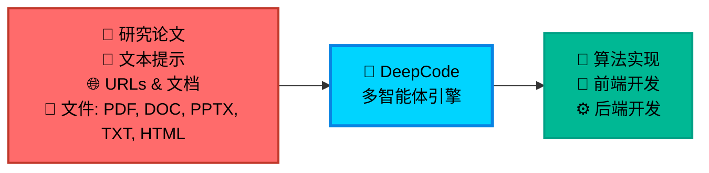

今天我们要看的项目是：https://github.com/HKUDS/DeepCode ，

## 概述

DeepCode 是一个基于多智能体系统的开源框架，旨在将研究论文、自然语言描述等输入自动转换为生产级代码。该项目通过自动化算法实现、前端开发和后端构建，显著提升了研发效率。其核心目标是解决研究人员在实现复杂算法时面临的挑战，减少开发延迟，并避免重复性编码工作。

DeepCode 支持多种输入形式，包括学术论文、文本提示、URL 和文档文件（如 PDF、DOC、PPTX、TXT、HTML），并能生成高质量、可扩展且功能丰富的代码。该系统采用多智能体协作架构，能够处理复杂的开发任务，从概念到可部署的应用程序。

