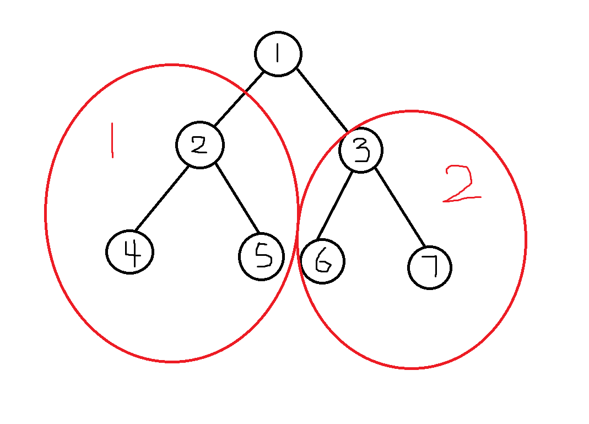
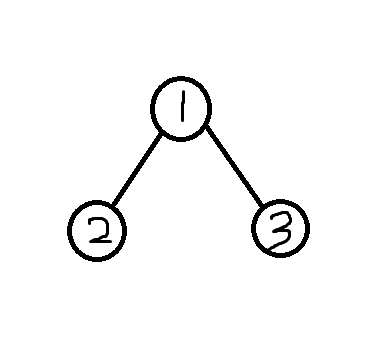

## 二叉树介绍

[二叉树_百度百科](https://baike.baidu.com/item/%E4%BA%8C%E5%8F%89%E6%A0%91/1602879)

二叉树由一个个节点构成，最上方是根节点，一个节点可能有它的左节点和右节点，由左节点作为根节点的树叫做左子树，由右节点作为根节点的树叫做右子树。



如图为一颗有七个节点的二叉树，节点1便是这颗树的根节点，而红圈1为根节点的左子树，红圈2为根节点的右子树。

### 如何描述一颗树

除了像这样直接画一张图出来，如何描述一颗树呢？

描述节点的对应关系：比如，直接叙述节点1为根节点，2和3分别为1的左子树和右子树。再描述2的左子树和右子树有等等。

这样直接叙述固然可行，下面给大家介绍几种常见的遍历树的方式。

### 层序遍历

即按照每层描述这颗树的元素。自上而下，自左而右。

按照上图，该树的层序遍历为：

```
1 2 3 4 5 6 7
```

### 前序遍历

从根节点开始，按照由节点本身，左节点，右节点的形式输出值。如果该节点有左子树和右子树，也按照该顺序。

按照上图，该树的前序遍历为：

```
1 2 4 5 3 6 7
```

### 中序遍历

从根节点开始，按照由左节点，节点本身，右节点的形式输出值。如果该节点有左子树和右子树，也按照该顺序。

按照上图，该树的中序遍历为：

```
4 2 5 1 6 3 7
```

### 后序遍历

从根节点开始，按照由左节点，右节点，节点本身的形式输出值。如果该节点有左子树和右子树，也按照该顺序。

按照上图，该树的后序遍历为：

```
4 5 2 6 7 3 1
```

### 注意

这四种遍历方法中，仍给两种遍历方法，可以帮我们得到一颗确定的树。

## 建树

在我们的代码中如何表示出一棵树？

我们先来想想每个节点的特性，首先，每个节点自身都有一个值，然后它可能有左节点或者右节点。（如果这个节点既没有左节点，也没有右节点的话，那么这个节点被称为叶子节点。）那么我们可以用一个结构体来表示每个节点。

```cpp
struct Node
{
    Node * left,* right; // 左节点的指针和右节点的指针
    int value; // 本身的值
    Node():left(NULL),right(NULL){}; // 初始化左节点和右节点为空
};
```

由于我们不清楚树的大小，因此我们对于每个节点都采用动态添加的方法。这个时候就要用到 **new** 和 **delete** 关键字。new可以动态申请一个内存用于对应的节点，delete可以删除(或者说归还更合适一点)掉申请的内存。

因此，我们可以这样直接新建一个节点。

```cpp
Node * newnode()
{
    return new Node();
}
```

那我们就可以这样构建一棵树。

```cpp
Node * root = newnode(); // 构建根节点
root->value = 1;
root->left = newnode(); // 构建根节点的左节点
root->left->value = 2;
root->right = newnode(); // 右节点
root->right->value = 3;
```



建出的树如图。

### dfs

那么我们如何遍历这颗树？以前序遍历为例。

```cpp
void dfs(Node * root)
{
    cout << root->value << " ";
    if(root->left!=NULL) dfs(root->left);
    if(root->right!=NULL) dfs(root->right);
    return;
}
```

这种遍历方式被称作深度优先搜索。通常使用递归的方式实现，既然是中左右的顺序，那么拿到一个节点，就立马输出这个节点的值，然后再递归的去搜它的左节点和右节点，直到搜完为止。

我开始遍历的方式便是：

```cpp
dfs(root);
```

同样的，我们的delete操作也可以用dfs的形式来写。

删完它的左右节点，再删他本身。

```cpp
void remove_tree(Node * u)
{
    if(u==NULL) return;
    remove_tree(u->left);
    remove_tree(u->right);
    delete u;
}
```

### bfs

曾经的博客中我介绍了stl的相关内容，那么借助queue队列，我们可以实现层序遍历。自上而下，自左而右。

```cpp
void bfs(Node * root)
{
    queue<Node *> q;
    q.push(root);
    while(!q.empty())
    {
        Node * cnt = q.front();
        q.pop();
        cout << cnt->value << " ";
        if(cnt->left!=NULL) queueTree.push(cnt->left);
        if(cnt->right!=NULL) queueTree.push(cnt->right);
    }
}
```

首先把第一层的元素扔进队列，也就是根节点，然后依次添加左节点，右节点，左节点再添加左节点右节点。

根据队列的特性，就可以实现自上而下，自左而右地访问到每一个节点。

这种遍历的方法被称做广度优先搜索。

## 例题

### uva122

题目链接：[Trees on the level - UVA 122 - Virtual Judge](https://vjudge.net/problem/UVA-122)

#### 题意

题意不难理解，即为先建树，再按层序遍历输出元素。

#### 难点解析

- 每个输入的格式显得有些难以处理
- 如何判断是否存在重复节点？
- 如何判断必要节点不存在？

让我们挨个解析

#### 难点1：输入处理

让我们以(7,LLL)为例。

我们从这个字符串中至少应该获取到两个数据，即节点的值和表示位置的字符串，那么我们可以用到string类自带的find函数和substr函数。

find函数可以查找到需要查找的字符在字符串中的位置(从0开始)

substr函数的第一个参数为子字符串开始的位置，第二个参数为需要截取的长度，因此，我们可以搜索,的位置，然后分别截取即可，示例代码如下

```cpp
// nodeTen为类似(7,LLL)的结构
nodeTen.substr(nodeTen.find(',')+1,nodeTen.length() - nodeTen.find(',') - 2) // LLL
atoi(nodeTen.substr(1,nodeTen.find(',')-1).c_str()) // 7
```

#### 难点2：判断节点是否重复

在node结构体中添加一个bool类型的变量用于记录之前是否赋值过即可。

#### 难点3：判断必要节点不存在

深搜或广搜一遍树，如果存在节点未被赋值，则说明必要节点不存在。

#### 示例代码

```cpp
#include <iostream>
#include <queue>
using namespace std;
struct Node
{
    bool haveValue;
    Node * left,* right;
    int value;
    Node():haveValue(false),left(NULL),right(NULL){};
};
Node * root = NULL;

Node * newnode()
{
    return new Node();
}

void remove_tree(Node * u)
{
    if(u==NULL) return;
    remove_tree(u->left);
    remove_tree(u->right);
    delete u;
}

bool addNode(string ten,int value)
{
    Node * currentNode = root;
    for(int i=0;i<ten.length();i++)
    {
        if(ten[i] == 'L')
        {
            if(currentNode->left==NULL) currentNode->left = newnode();
            currentNode = currentNode->left;
        }
        else
        {
            if(currentNode->right==NULL) currentNode->right = newnode();
            currentNode = currentNode->right;
        }
    }
    if(currentNode->haveValue)
    {
        return false;
    }
    currentNode->haveValue = true;
    currentNode->value = value;
    return true;
}

int main()
{
    string nodeTen;
    while(cin >> nodeTen)
    {
        remove_tree(root);
        root = newnode();
        bool flag = true;
        flag = addNode(nodeTen.substr(nodeTen.find(',')+1,nodeTen.length() - nodeTen.find(',') - 2),atoi(nodeTen.substr(1,nodeTen.find(',')-1).c_str()));
        while(cin >> nodeTen && nodeTen!="()")
        {
            if(flag)
            {
                flag = addNode(nodeTen.substr(nodeTen.find(',')+1,nodeTen.length() - nodeTen.find(',') - 2),atoi(nodeTen.substr(1,nodeTen.find(',')-1).c_str()));
            }
        }
        if(nodeTen == "()")
        {
            if(!flag)
            {
                cout << "not complete\n";
                continue;
            }
            else
            {
                bool rightAns = true;
                vector<int> ans;
                queue<Node *> queueTree;
                queueTree.push(root);
                while(!queueTree.empty())
                {
                    Node * cnt = queueTree.front();
                    queueTree.pop();
                    if(!cnt->haveValue)
                    {
                        rightAns = false;
                        break;
                    }
                    ans.push_back(cnt->value);
                    if(cnt->left!=NULL) queueTree.push(cnt->left);
                    if(cnt->right!=NULL) queueTree.push(cnt->right);
                }
                if(!rightAns)
                {
                    cout << "not complete";
                }
                else
                {
                    for(auto i = ans.begin();i!=ans.end();i++)
                    { 
                        cout << *i;
                        if(i!=ans.end()-1)
                        {
                            cout << " ";
                        }
                    }
                }
                cout << "\n";
            }
        }
    }
    return 0;
}
```

### uva548

[题目链接](https://vjudge.net/problem/UVA-548)

这题很显然符合我们刚刚提到的结论，给出四种遍历方式中的两种，一定可以确定一棵树，自然也就可以输出其第三种遍历。

那么本题中根据中序和后序，我们应该如何建树呢？

以这组数据为例

```
3 2 1 4 5 7 6
3 1 2 5 6 7 4
```

后序遍历的形式是左右中，也就是说，最后一个子节点一定是这棵树的根节点。

而中序遍历的形式是左中右，也就是说，根节点的左边是左子树的中序遍历，根节点的右边为右子树的中序遍历。

可以得出，左子树的元素个数为3，因为后序遍历以左右中的形式，所以左子树的后序遍历为前三个元素。右子树可以类比。

根据**分治**的思想，我们就可以如此不断的建树。直到中序遍历和后序遍历都只有一个元素为止。

建树完成，再深搜一遍确定最小值即可。

因此，示例代码如下，代码中用到的方式是以数组的形式建树（用两个数组分别表示对应节点的左节点和右节点是啥）。

```cpp
#include <iostream>
#include <sstream>
using namespace std;
int tree_zhong[10001];
int tree_hou[10001];
int lch[10001],rch[10001];
int n;
void loadTree(string cmd,string pos)
{
    stringstream s(cmd);
    n=0;
    int x;
    if(pos == "zhong")
    {
        while(s>>x)
        {
            tree_zhong[n] = x;
            n++;
        }
    }
    else
    {
        while(s>>x)
        {
            tree_hou[n] = x;
            n++;
        }
    }
}

int buildTree(int l1,int r1,int l2,int r2)
{
    if (l1>r1)
    {
        return -1;
    }
    int root = tree_hou[r2];
    int p;
    for(int i=l1;i<=r1;i++)
    {
        if(tree_zhong[i] == root)
        {
            p = i;
            break;
        }
    }
    lch[p] = buildTree(l1,p-1,l2,l2+p-l1-1);
    rch[p] = buildTree(p+1,r1,l2+p-l1,r2-1);
    return p;
}

int sumMin = -1;
int minID = -1;
void dfs(int root,int sum)
{
    sum += tree_zhong[root];
    if(lch[root]==-1 && rch[root]==-1)
    {
        if(sumMin == -1)
        {
            sumMin = sum;
            minID = root;
        }
        if(sum == sumMin)
        {
            if(tree_zhong[root] < tree_zhong[minID]) //不加这个判断uva也过了
            {
                sumMin = sum;
                minID = root;
            }
        }
        if(sum < sumMin)
        {
            sumMin = sum;
            minID = root;
        }
        return;
    }
    if(lch[root]!=-1)
    {
        dfs(lch[root],sum);
    }
    if(rch[root]!=-1)
    {
        dfs(rch[root],sum);
    }
}
int main()
{
    string cmd;
    while(getline(cin,cmd))
    {
        sumMin = -1;
        minID = -1;
        loadTree(cmd,"zhong");
        getline(cin,cmd);
        loadTree(cmd,"hou");
        int root = buildTree(0,n-1,0,n-1);
        dfs(root,0);
        cout << tree_zhong[minID] << endl;
    }
    return 0;
}
```

### uva839

[题目链接](https://vjudge.net/problem/UVA-839)

这题虽然一眼看上去是二叉树的形式，实际上并不需要建树。

通过对于引用的妙用可以实现同步左子树和右子树的重量的作用。具体代码如下，易懂但思路难想，因为其特殊结构被引入到该文中。

示例代码：

```cpp
#include<iostream>
using namespace std;
bool solve(int & w)
{
    int w1,l1,w2,l2;
    cin >> w1 >> l1 >> w2 >> l2;
    bool b1 = true,b2 = true;
    if(w1==0) b1 = solve(w1);
    if(w2==0) b2 = solve(w2);
    w = w1 + w2;
    return b1 && b2 && (w1*l1 == w2*l2);
}
int main()
{
    int n;
    cin >> n;
    for(int i=1;i<=n;i++)
    {
        int w;
        if(solve(w))
        {
            cout << "YES" << endl;
        }
        else
        {
            cout << "NO" << endl;
        } 
        if(i!=n)
        {
            cout << endl;
        }
    }
    return 0;
}
```