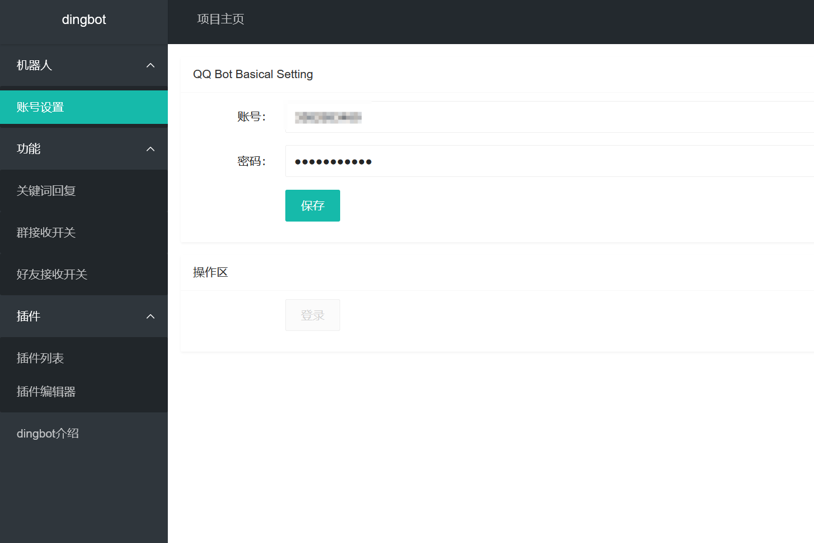

## 简述

自从酷Q时代开始乃至更早时期，QQ机器人便出现在大家的视野里，由于被使用于一些不正当领域~~以及某些不可告人的原因~~，QQ Robot被QQ官方ban了很长时间，直到最近官方放出了部分机器人权限，以及onebot等对于协议的贡献，QQ Robot恢复了部分功能，dingbot便由于本作者的需求重构出了v2版本。

链接：**https://github.com/dingdinglz/dingbot**

## 实现功能

- [x] 扫码登录及后续自动登录

- [x] 关键词回复

- [x] 违禁词系统

- [ ] 插件系统（blockly + lua）

## 实现方法

golang + html

golang下对接[Lagrange](https://github.com/LagrangeDev/LagrangeGo)，以[fiber](https://github.com/gofiber/fiber)框架作为web框架，html以[layui](https://layui.dev)构建前端界面

## 画廊

