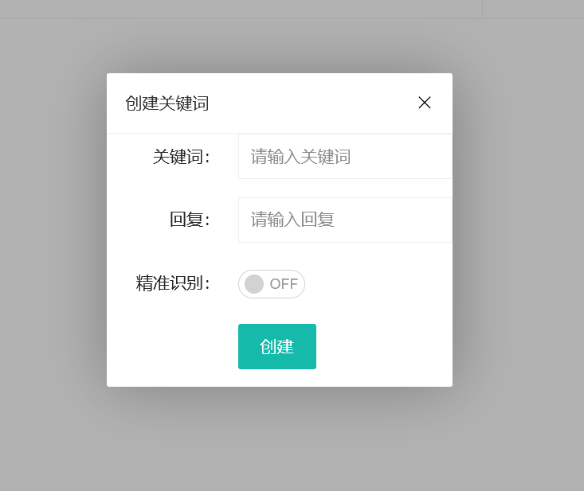

## 简述

自从酷Q时代开始乃至更早时期，QQ机器人便出现在大家的视野里，由于被使用于一些不正当领域~~以及某些不可告人的原因~~，QQ Robot被QQ官方ban了很长时间，直到最近官方放出了部分机器人权限，以及onebot等对于协议的贡献，QQ Robot恢复了部分功能，dingbot便由于本作者的需求重构出了v2版本。

链接：**https://github.com/dingdinglz/dingbot**

## 已支持功能

请移步github查看

## 实现方法

golang + html

golang下对接[Lagrange](https://github.com/LagrangeDev/LagrangeGo)，以[fiber](https://github.com/gofiber/fiber)框架作为web框架，html以[layui](https://layui.dev)构建前端界面

## 画廊





## 编译方法

### 前置条件

安装golang

### 编译方法

```bash
go build
```

### 产物

将所得的dingbot.exe（其他系统后缀可能不同）与web文件夹复制到新的文件夹中，此时的dingbot可以直接运行。

此时你的文件夹结构应该为

```
- dingbot[.exe]
- web
```

## 运行方法

打开dingbot可执行文件，第一次使用会为你打开初始化界面，完成设置后重启dingbot即可。

首先在账号设置栏中保存QQ账号与密码，点击保存。

点击下方登录进行登录，初次登录需要扫描二维码。后续登录如sig未失效可直接登录。

提示登录成功后机器人便进入正常运行状态。

### 关键词回复

点击创建可以创建新的关键词。

精确识别为消息必须完美符合关键词才会发送回复内容。

非精确识别则如果消息包含关键词即发送回复内容。

### 群接收开关 && 好友接收开关

开启后机器人才会对对应群和好友的消息进行处理。否则dingbot自带功能与插件功能无法在对应的对话中生效。

### 插件

新建插件后即会为你创建一个新的插件源码，点击编辑后会进入插件编辑器中进行编辑。

一个完整的插件**至少**拥有插件信息提供事件，即事件中第一个，将其拖至编辑器中，用文本填充相关信息即可。

#### 事件

所有的事件的实现方法都拖至事件内部处理。

在对应的事件中可以使用对应的参数。

#### 保存

编辑完插件后记得保存，否则下次将丢失上次编辑。

#### 生成

插件编辑完后无法立即进入工作状态，点击生成插件后才会生成正式的插件文件，若你可以在插件列表中看到该插件，即为生成成功，并进入工作状态。

#### 插件的获取

当然，除了自己编写插件以外，可以从社区下载他人制作完成的插件，复制到对应的文件夹中，若你可以在插件列表中看到该插件，即为添加成功。