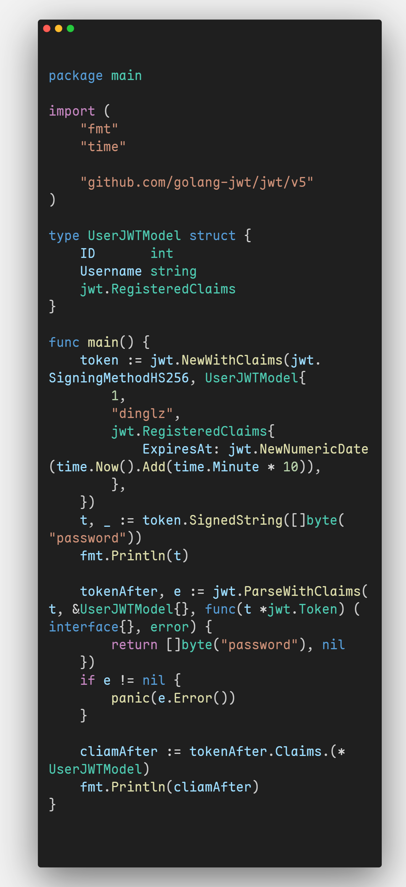

## 什么是JWT

jwt，全称[JSON Web Token](https://datatracker.ietf.org/doc/html/rfc7519)，是一种开放标准（RFC 7519），用于在网络应用环境间安全地传输信息。这些信息可以被验证和信任，因为它们是数字签名的。JWT可以使用秘密（使用HMAC算法）或使用RSA或ECDSA的公钥/私钥对进行签名。

## JWT的用途

JWT的主要目的是在各方之间传递声明。声明是对实体（通常是用户）的某些属性的断言，例如身份、访问权限等。这些声明以紧凑的形式编码为一个字符串，非常适合在Web环境中使用，尤其是在HTTP头部中作为承载令牌（Bearer Token）。

在我们设计网站时，经常应用jwt用来鉴权，判断用户的登录状态，今天主要介绍利用[GitHub - golang-jwt/jwt: Go implementation of JSON Web Tokens (JWT).](https://github.com/golang-jwt/jwt)包，实现Go语言下的jwt生成和解析。

例如，在中间件中，我们可以通过设置过期日期，然后解析jwt，来判断用户的登录状态。

## 安装

```bash
go get -u github.com/golang-jwt/jwt/v5
```

## 生成

本文介绍如何编码和解码一个自定义结构体

为模拟真实使用环境，我们首先定义一个结构体类型，如下，包含用户名和id字段

```go
type UserJWTModel struct {
	ID       int
	Username string
	jwt.RegisteredClaims
}
```

**jwt.RegisteredClaims**里包含了一些jwt约定好的字段，比如**ExpiresAt**，可以约定jwt的过期时间。以及其他字段，下面我们仅仅用到了**ExpiresAt**，更详细的请查阅jwt的文档。

然后新建一个token，填入数据

```go
token := jwt.NewWithClaims(jwt.SigningMethodHS256, UserJWTModel{
		1,
		"dinglz",
		jwt.RegisteredClaims{
			ExpiresAt: jwt.NewNumericDate(time.Now().Add(time.Minute * 10)),
		},
	})
```

这里约定好过期时间是十分钟后

然后用一个password生成jwt

```go
t, _ := token.SignedString([]byte("password"))
fmt.Println(t)
```

### 完整示例

```go
package main

import (
	"fmt"
	"time"

	"github.com/golang-jwt/jwt/v5"
)

type UserJWTModel struct {
	ID       int
	Username string
	jwt.RegisteredClaims
}

func main() {
	token := jwt.NewWithClaims(jwt.SigningMethodHS256, UserJWTModel{
		1,
		"dinglz",
		jwt.RegisteredClaims{
			ExpiresAt: jwt.NewNumericDate(time.Now().Add(time.Minute * 10)),
		},
	})
	t, _ := token.SignedString([]byte("password"))
	fmt.Println(t)
}

```

## 解析

```go
tokenAfter, e := jwt.ParseWithClaims(t, &UserJWTModel{}, func(t *jwt.Token) (interface{}, error) {
		return []byte("password"), nil
	})
	if e != nil {
		panic(e.Error())
	}
```

t是我们上面生成的字符串，然后选择解析的模型，最后在传回加密时的密码，即可得到解析后的token，如果过期或者密码错误等会使**e!=nil**，因此可以通过是否错误来判断登录是否过期。

取回我们解析后的结构体

```go
cliamAfter := tokenAfter.Claims.(*UserJWTModel)
```

经验证，我们取出了传进去的数据。

### 完整示例

```go
package main

import (
	"fmt"
	"time"

	"github.com/golang-jwt/jwt/v5"
)

type UserJWTModel struct {
	ID       int
	Username string
	jwt.RegisteredClaims
}

func main() {
	token := jwt.NewWithClaims(jwt.SigningMethodHS256, UserJWTModel{
		1,
		"dinglz",
		jwt.RegisteredClaims{
			ExpiresAt: jwt.NewNumericDate(time.Now().Add(time.Minute * 10)),
		},
	})
	t, _ := token.SignedString([]byte("password"))
	fmt.Println(t)

	tokenAfter, e := jwt.ParseWithClaims(t, &UserJWTModel{}, func(t *jwt.Token) (interface{}, error) {
		return []byte("password"), nil
	})
	if e != nil {
		panic(e.Error())
	}

	cliamAfter := tokenAfter.Claims.(*UserJWTModel)
	fmt.Println(cliamAfter)
}

```

## 实际应用

比如我们可以在登录后往cookie中存入jwt，然后在需要鉴权的地方用中间件解析他，如果能成功则不用验证其他内容，因为在某种程度上我们可以认为jwt不会被伪造。





