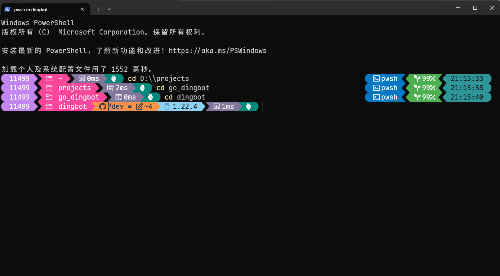

## 简介

本文将借助[Oh My Posh](https://ohmyposh.dev/)美化终端，有多款皮肤可选。

最终大概能达到这个效果（一种）：



**注意**：本文仅介绍powershell的安装方式，cmd、bash等可前往官网找到安装方式。

## 安装

```powershell
Set-ExecutionPolicy Bypass -Scope Process -Force; Invoke-Expression ((New-Object System.Net.WebClient).DownloadString('https://ohmyposh.dev/install.ps1'))
```

为了使 `PATH` 重新加载，建议重启您的终端。如果 oh-my-posh 未被识别为命令，您可以再次运行安装程序，或者手动将其添加到 `PATH` 中。例如：

```powershell
$env:Path += ";C:\Users\user\AppData\Local\Programs\oh-my-posh\bin"
```

## 挑选皮肤

安装完成后，前往[本页面](https://ohmyposh.dev/docs/themes)挑选一款心仪的皮肤，将其下载下来，保存至一个JSON文件

## 配置终端

打开终端脚本配置文件

```powershell
notepad $PROFILE
```

当上述命令出现错误时，请确保先创建配置文件，即执行下面的语句，顺利执行则不用执行下面的语句。

```powershell
New-Item -Path $PROFILE -Type File -Force
```

在打开的记事本的末尾加上

```powershell
oh-my-posh init pwsh --config "你刚刚下载下来的那个json文件的绝对地址" | Invoke-Expression
```

保存，并重启终端，你就能得到一个好看的终端啦。

**Enjoy it**
